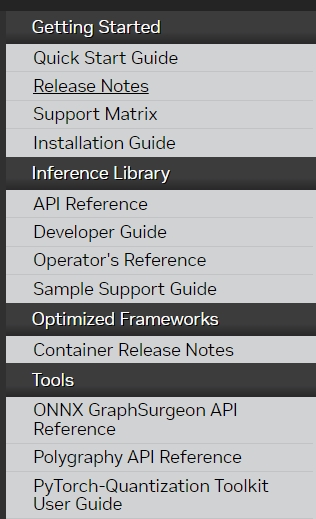

[Developer Guide lix19937个人中文版本](./developer_guide/readme.md)   

|**topic**                       | **主题**| **备注**   |      
|    ---                         | --- |     --- |          
|[overview](./overview.md)       |概述  |   |            
|[layout](./layout/readme.md)    |内存布局|      |            
|[graph-optimize](./graph-optimize/readme.md)    |图优化|   |             
|[dynamic](./dynamic/readme.md)  |动态shape |     |         
|[plugin](./plugin/readme.md)    |插件  |      |           
|[calibration](./calibration/readme.md)  |标定 |    |                
|[asp](./asp/readme.md)          |稀疏 |        |         
|[qat](./qat/readme.md)          |量化感知训练 |      |           
|[trtexec](./trtexec/readme.md)         |辅助工具 |     |           
|[inferflow](./inferflow/readme.md) |模型调度|      |         
|[cookbook](https://github.com/lix19937/trt-samples-for-hackathon-cn/blob/master/cookbook/) |食谱|      |         
|[faqs](./faqs.md)                  |快速问答|      |           

https://docs.nvidia.com/deeplearning/tensorrt/     
   

--------------------------------------     
## ref    
https://docs.nvidia.com/deeplearning/tensorrt/archives/   
https://github.com/HeKun-NVIDIA/TensorRT-Developer_Guide_in_Chinese/tree/main   
https://developer.nvidia.com/search?page=1&sort=relevance&term=   
