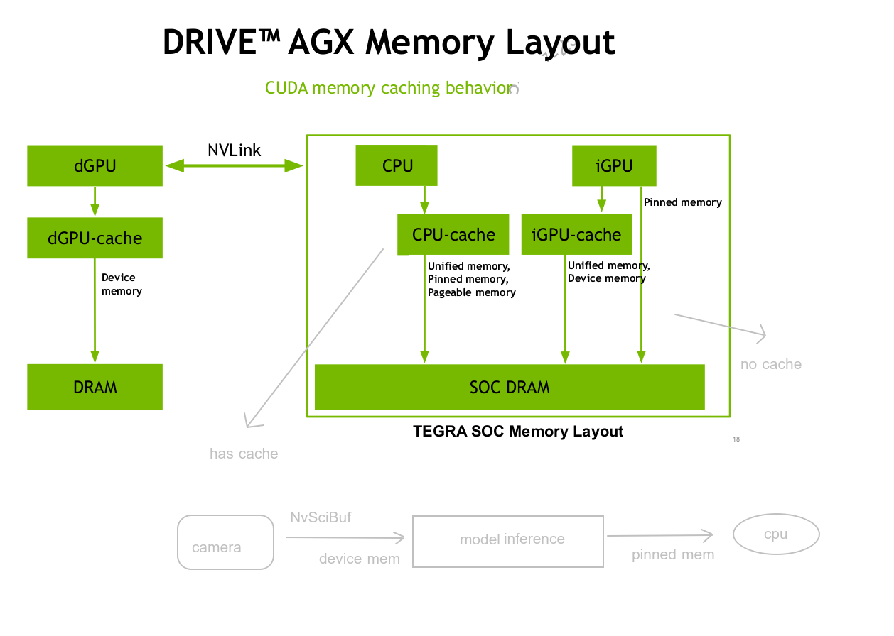
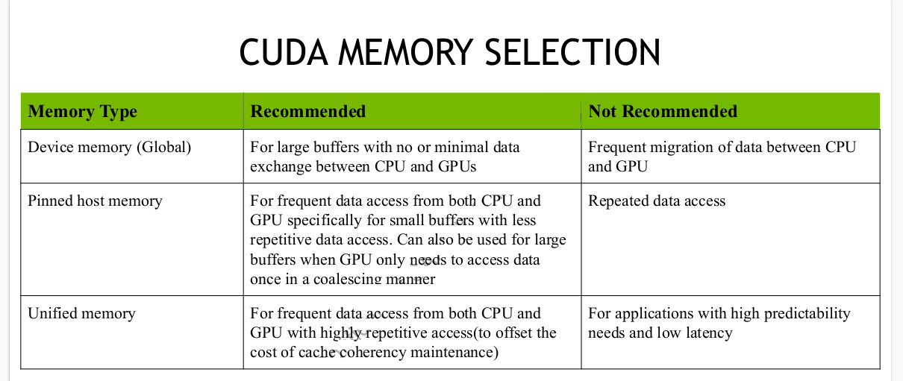

# thor-u/orin-x 几种内存       

Tegra 芯片（如 Orin、Thor）采用的是统一内存架构（UMA, Unified Memory Architecture），即 CPU 和集成 GPU（iGPU）共享同一块物理内存（SOC DRAM）。

SOC DRAM：这是 Tegra SoC 的片上统一物理内存。   

## CPU 访问路径       
CPU 通过 CPU-cache 访问 SOC DRAM。   
此路径支持的内存类型包括：Unified memory（统一内存）、Pinned memory（锁页/固定内存） 和 Pageable memory（可分页内存）。

## iGPU 访问路径       
带缓存访问：iGPU 通过 iGPU-cache 访问 SOC DRAM，主要支持 Unified memory 和 Device memory。  
绕过缓存访问（Pinned memory）：图片中有一条从 iGPU 直连 SOC DRAM 的箭头，标有 Pinned memory。  
这意味着当 iGPU 访问零拷贝（Zero-copy）的固定内存时，会绕过 iGPU-cache，直接读写 SOC DRAM，**以确保 CPU 和 iGPU 之间的底层数据一致性，避免缓存污染或冲突**。

## 跨芯片互联：NVLink    
dGPU 与 Tegra SoC 的连接：两部分通过 NVLink 高速互联总线进行双向通信。   
这使得左侧的 dGPU 可以跨芯片高速访问右侧 Tegra SoC 的内存系统，反之亦然。  
这在双芯片或多芯片的自动驾驶计算平台（如 DRIVE AGX 平台，组合了 Tegra SoC 和 独立 PCIe GPU）中，是实现高效并行计算和数据传输（如跨芯片的统一内存分配、托管内存同步）的基础硬件纽带。

## 缓存行为差异     
iGPU 访问 Device memory / Unified memory 时走内部 cache，但访问 Pinned memory（零拷贝内存）时会绕过缓存直达 SOC DRAM。

## 物理内存隔离与共享   
dGPU 拥有完全独立的物理 DRAM；而 SoC 端（CPU 和 iGPU）在物理上共享同一个 SOC DRAM，但针对不同的内存类型（Pageable, Pinned, Unified）有着不同的硬件缓存策略。  

## 高速拓扑   
通过 NVLink 将 UMA 架构的 SoC 与传统的 dGPU 架构强绑定，构成了高吞吐、低延迟的混合自动驾驶异构计算平台。

## Pinned mem 应用场景   
> For frequent data access from both CPU and GPU specifically for small buffers with less repetitive data access.  
> Can also be used for large buffers when GPU only needs to access data

Pinned Memory 在 GPU 访问时会绕过 iGPU-cache 直达物理内存。基于这个硬件特性，官方给出了以下两个场景的推荐：   
### 场景一：小缓冲区、双端频繁访问、数据重复利用率低     
"For frequent data access from both CPU and GPU specifically for small buffers with less repetitive data access."

痛点背景： 如果使用传统的 cudaMemcpy，每次传输数据都有固定的启动开销（Launch Overhead）。`对于几个字节或几 KB 的小缓冲区（Small buffers）`，**传输耗时可能比拷贝耗时还要长**，非常不划算。那为什么推荐使用锁页内存？    
零拷贝（Zero-copy）： CPU 和 GPU 映射到同一块物理地址，CPU 写完后，GPU 可以通过内存总线直接去读，省去了显式调用显存拷贝的指令和同步开销。    
数据重复利用率低（Less repetitive data access）： 因为锁页内存不经过 GPU 缓存（Bypass cache），如果 GPU 频繁读取同一块数据，每次都要走总线去 DRAM 读，延迟会很高。但如果数据“用完就扔”（重复利用率低），不进缓存反而是一件好事——它不会污染 GPU 的 Cache，把宝贵的 Cache 留给其他更需要高频重复计算的任务。     
典型例子： 每一帧都在更新的控制参数、配置 Flag、目标检测的独立 ROI 框坐标等。   

### 场景二：大缓冲区、GPU 只访问一次、满足合并访问条件    
"Can also be used for large buffers when GPU only needs to access data once in a coalescing manner"

痛点背景：通常大缓冲区（Large buffers，如高分辨率图像、大点云）我们习惯用 cudaMemcpy 拷到独立显存（Device Memory）里让 GPU 访问，因为本地显存带宽最高。但为什么这里说大缓冲区也可以用锁页内存？   
必须同时满足两个严苛条件：    
GPU 只访问一次（Access data once）： 数据从总线拉过来，GPU Thread 算完就结束了，后续不再需要重复读取它。如果大跑道只跑一次，就没必要大费周章地把整个数据集先从 Host 搬运到 Device，再从 Device 读进 Kernel，直接“边拉边算”更高效。     
合并访问（Coalescing manner）： 这是最关键的硬件要求。GPU 的 Warp（32个线程）在访问锁页内存时，如果内存地址是连续的，硬件会将这 32 个线程的访存请求合并成一次总线事务（Bus Transaction）拉取过来。   
如果满足会怎样？**虽然没有了 GPU Cache，但因为是合并访问，总线带宽被彻底吃满，吞吐量依然非常高**，完美掩盖了没有 Cache 的劣势。    
典型例子： 自动驾驶中的图像预处理（如 Resize、YUV 转 RGB）。输入是一张很大的相机图片，CPU 丢进锁页内存，GPU Kernel 启动后，线程以连续合并的方式（Coalesced）读取像素，做完归一化直接写进 GPU 自身的 Device Memory 供后续主网络使用。这张原始大图整个计算过程中只被读了一次。

锁页内存的精髓在于 “用空间和带宽换取传输时延” 

```
                     数据量有多大？
                     /         \
              [ 小缓冲区 ]      [ 大缓冲区 ]
                  /                 \
          是否双端频繁交互？         GPU 需要反复迭代访问它吗？
              /       \                /                 \
          (是)        (否)          (是)                 (否)
           │           │             │                    │
    ┌──────▼──────┐ ┌──▼───┐  ┌──────▼──────┐      是否需要确定性低延迟？
    │ Pinned 内存 │ │Device│  │ Device 内存 │       /               \
    └─────────────┘ └──────┘  └─────────────┘     (是)              (否)
                                                   │                 │
                                            ┌──────▼──────┐   ┌──────▼──────┐
                                            │ Pinned 内存 │   │ Unified 内存│
                                            │ (合并访问)   │   └─────────────┘
                                            └─────────────┘
```
