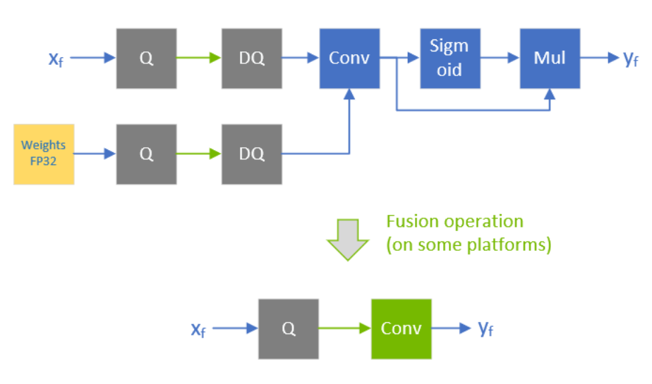
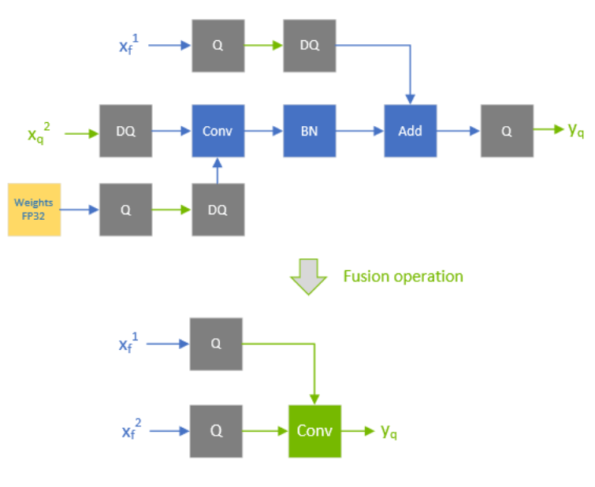

# 7. 如何使用TensorRT中的INT8

## 7.1. Introduction to Quantization
TensorRT 支持使用 8 位整数来表示量化的浮点值。量化方案是对称均匀量化 - 量化值以有符号 INT8 表示，从量化到非量化值的转换只是一个乘法。在相反的方向上，量化使用倒数尺度，然后是舍入和钳位。

要启用任何量化操作，必须在构建器配置中设置 INT8 标志。

### 7.1.1. Quantization Workflows

创建量化网络有两种工作流程：

训练后量化(PTQ: Post-training quantization) 在网络经过训练后得出比例因子。 TensorRT 为 PTQ 提供了一个工作流程，称为校准(`calibration`)，当网络在代表性输入数据上执行时，它测量每个激活张量内的激活分布，然后使用该分布来估计张量的尺度值。

量化感知训练(QAT: Quantization-aware training) 在训练期间计算比例因子。这允许训练过程补偿量化和去量化操作的影响。

TensorRT 的[量化工具包](https://github.com/NVIDIA/TensorRT/tree/main/tools/pytorch-quantization)是一个 PyTorch 库，可帮助生成可由 TensorRT 优化的 QAT 模型。您还可以利用工具包的 PTQ 方式在 PyTorch 中执行 PTQ 并导出到 ONNX。

### 7.1.2. Explicit vs Implicit Quantization

量化网络可以用两种方式表示：

在隐式量化网络中，每个量化张量都有一个相关的尺度。在读写张量时，尺度用于隐式量化和反量化值。

在处理隐式量化网络时，TensorRT 在应用图形优化时将模型视为浮点模型，并适时的使用 INT8 来优化层执行时间。如果一个层在 INT8 中运行得更快，那么它在 INT8 中执行。否则，使用 FP32 或 FP16。在这种模式下，TensorRT 仅针对性能进行优化，您几乎无法控制 INT8 的使用位置——即使您在 API 级别明确设置层的精度，TensorRT 也可能在图优化期间将该层与另一个层融合，并丢失它必须在 INT8 中执行的信息。 TensorRT 的 PTQ 功能可生成隐式量化网络。

在显式量化的网络中，在量化和未量化值之间转换的缩放操作由图中的`IQuantizeLayer` ( [C++](https://docs.nvidia.com/deeplearning/sdk/tensorrt-api/c_api/classnvinfer1_1_1_i_quantize_layer.html) , [Python](https://docs.nvidia.com/deeplearning/sdk/tensorrt-api/python_api/infer/Graph/Layers.html#iquantizelayer))和`IDequantizeLayer` ( [C++](https://docs.nvidia.com/deeplearning/sdk/tensorrt-api/c_api/classnvinfer1_1_1_i_dequantize_layer.html) , [Python](https://docs.nvidia.com/deeplearning/sdk/tensorrt-api/python_api/infer/Graph/Layers.html#idequantizelayer) ) 节点显式表示 - 这些节点此后将被称为 Q/DQ 节点。与隐式量化相比，显式形式精确地指定了与 INT8 之间的转换在何处执行，并且优化器将仅执行由模型语义规定的精度转换，即使：

* 添加额外的转换可以提高层精度（例如，选择 FP16 内核实现而不是 INT8 实现）

* 添加额外的转换会导致引擎执行得更快（例如，选择 INT8 内核实现来执行指定为具有浮点精度的层，反之亦然）

ONNX 使用显式量化表示 - 当 PyTorch 或 TensorFlow 中的模型导出到 ONNX 时，框架图中的每个伪量化操作都导出为 Q，然后是 DQ。由于 TensorRT 保留了这些层的语义，因此您可以期望任务准确度非常接近框架中看到的准确度。虽然优化保留了量化和去量化的位置，但它们可能会改变模型中浮点运算的顺序，因此结果不会按位相同。
请注意，与 TensorRT 的 PTQ 相比，在框架中执行 QAT 或 PTQ 然后导出到 ONNX 将产生一个明确量化的模型。

<div class="tablenoborder"><a name="explicit-implicit-quantization__table_tyj_kjm_sqb" shape="rect">
                                    <!-- --></a><table cellpadding="4" cellspacing="0" summary="" id="explicit-implicit-quantization__table_tyj_kjm_sqb" class="table" frame="border" border="1" rules="all">
                                    <caption><span class="tablecap">Table 2. Implicit vs Explicit Quantization</span></caption>
                                    <thead class="thead" align="left">
                                       <tr class="row">
                                          <th class="entry" valign="top" width="33.33333333333333%" id="d54e4235" rowspan="1" colspan="1">&nbsp;</th>
                                          <th class="entry" valign="top" width="33.33333333333333%" id="d54e4237" rowspan="1" colspan="1">Implicit Quantization</th>
                                          <th class="entry" valign="top" width="33.33333333333333%" id="d54e4240" rowspan="1" colspan="1">Explicit Quantization</th>
                                       </tr>
                                    </thead>
                                    <tbody class="tbody">
                                       <tr class="row">
                                          <td class="entry" valign="top" width="33.33333333333333%" headers="d54e4235" rowspan="1" colspan="1">User control over precision</td>
                                          <td class="entry" valign="top" width="33.33333333333333%" headers="d54e4237" rowspan="1" colspan="1">Little control: INT8 is used in all kernels for which it
                                             accelerates performance.
                                          </td>
                                          <td class="entry" valign="top" width="33.33333333333333%" headers="d54e4240" rowspan="1" colspan="1">Full control over quantization/dequantization boundaries.</td>
                                       </tr>
                                       <tr class="row">
                                          <td class="entry" valign="top" width="33.33333333333333%" headers="d54e4235" rowspan="1" colspan="1">Optimization criterion</td>
                                          <td class="entry" valign="top" width="33.33333333333333%" headers="d54e4237" rowspan="1" colspan="1">Optimize for performance.</td>
                                          <td class="entry" valign="top" width="33.33333333333333%" headers="d54e4240" rowspan="1" colspan="1">Optimize for performance while maintaining arithmetic precision
                                             (accuracy).
                                          </td>
                                       </tr>
                                       <tr class="row">
                                          <td class="entry" valign="top" width="33.33333333333333%" headers="d54e4235" rowspan="1" colspan="1">API</td>
                                          <td class="entry" valign="top" width="33.33333333333333%" headers="d54e4237" rowspan="1" colspan="1"><a name="explicit-implicit-quantization__ul_qp2_pjm_sqb" shape="rect">
                                                <!-- --></a><ul class="ul" id="explicit-implicit-quantization__ul_qp2_pjm_sqb">
                                                <li class="li">Model + Scales (dynamic range API)</li>
                                                <li class="li">Model + Calibration data</li>
                                             </ul>
                                          </td>
                                          <td class="entry" valign="top" width="33.33333333333333%" headers="d54e4240" rowspan="1" colspan="1">Model with Q/DQ layers.</td>
                                       </tr>
                                       <tr class="row">
                                          <td class="entry" valign="top" width="33.33333333333333%" headers="d54e4235" rowspan="1" colspan="1">Quantization scales</td>
                                          <td class="entry" valign="top" width="33.33333333333333%" headers="d54e4237" rowspan="1" colspan="1">
                                             <div class="p">Weights:<a name="explicit-implicit-quantization__ul_kmk_rjm_sqb" shape="rect">
                                                   <!-- --></a><ul class="ul" id="explicit-implicit-quantization__ul_kmk_rjm_sqb">
                                                   <li class="li">Set by TensorRT (internal)</li>
                                                   <li class="li">Range <samp class="ph codeph">[-127, 127]</samp></li>
                                                </ul>
                                             </div>
                                             <div class="p">Activations:<a name="explicit-implicit-quantization__ul_xj5_sjm_sqb" shape="rect">
                                                   <!-- --></a><ul class="ul" id="explicit-implicit-quantization__ul_xj5_sjm_sqb">
                                                   <li class="li">Set by calibration or specified by the user</li>
                                                   <li class="li">Range <samp class="ph codeph">[-128, 127]</samp></li>
                                                </ul>
                                             </div>
                                          </td>
                                          <td class="entry" valign="top" width="33.33333333333333%" headers="d54e4240" rowspan="1" colspan="1">Weights and activations:<a name="explicit-implicit-quantization__ul_z2h_5jm_sqb" shape="rect">
                                                <!-- --></a><ul class="ul" id="explicit-implicit-quantization__ul_z2h_5jm_sqb">
                                                <li class="li">Specified using Q/DQ ONNX operators</li>
                                                <li class="li">Range <samp class="ph codeph">[-128, 127]</samp></li>
                                             </ul>
                                          </td>
                                       </tr>
                                    </tbody>
                                 </table>
                              </div>


有关量化的更多背景信息，请参阅深度学习推理的整数量化：[原理和实证评估](https://arxiv.org/abs/2004.09602)论文。

### 7.1.3. Per-Tensor and Per-Channel Quantization
有两种常见的量化尺度粒度：
* 每张量量化：其中使用单个比例值（标量）来缩放整个张量。
* 每通道量化：沿给定轴广播尺度张量 - 对于卷积神经网络，这通常是通道轴。

通过显式量化，权重可以使用每张量量化进行量化，也可以使用每通道量化进行量化。在任何一种情况下，比例精度都是 FP32。激活只能使用每张量量化来量化。

当使用每通道量化时，量化轴必须是输出通道轴。例如，当使用`KCRS`表示法描述 2D 卷积的权重时， K是输出通道轴，权重量化可以描述为：

```Python
For each k in K:
    For each c in C:
        For each r in R:
            For each s in S:
                output[k,c,r,s] := clamp(round(input[k,c,r,s] / scale[k]))
```
比例尺是一个系数向量，必须与量化轴具有相同的大小。量化尺度必须由所有正浮点系数组成。四舍五入方法是四舍五入到最近的关系到偶数，并且钳位在[-128, 127]范围内。

除了定义为的逐点操作外，反量化的执行方式类似：
```Python
output[k,c,r,s] := input[k,c,r,s] * scale[k]
```
TensorRT 仅支持激活张量的每张量量化，但支持卷积、反卷积、全连接层和 MatMul 的每通道权重量化，其中第二个输入是常数且两个输入矩阵都是二维的。

## 7.2. Setting Dynamic Range
TensorRT 提供 API 来直接设置动态范围（必须由量化张量表示的范围），以支持在 TensorRT 之外计算这些值的隐式量化。
API 允许使用最小值和最大值设置张量的动态范围。由于 TensorRT 目前仅支持对称范围，因此使用`max(abs(min_float), abs(max_float))`计算比例。请注意，当`abs(min_float) != abs(max_float)`时，TensorRT 使用比配置更大的动态范围，这可能会增加舍入误差。

将在 INT8 中执行的操作的所有浮点输入和输出都需要动态范围。

您可以按如下方式设置张量的动态范围：
**C++**

**tensor->setDynamicRange(min_float, max_float);**

**Python**

**tensor.dynamic_range = (min_float, max_float)**

[sampleINT8API](https://github.com/NVIDIA/TensorRT/tree/main/samples/sampleINT8API)说明了这些 API 在 C++ 中的使用。


## 7.3. Post-Training Quantization using Calibration

在训练后量化中，TensorRT 计算网络中每个张量的比例值。这个过程称为校准，需要您提供有代表性的输入数据，TensorRT 在其上运行网络以收集每个激活张量的统计信息。

所需的输入数据量取决于应用程序，但实验表明大约 500 张图像足以校准 ImageNet 分类网络。

给定激活张量的统计数据，决定最佳尺度值并不是一门精确的科学——它需要平衡量化表示中的两个误差源：离散化误差（随着每个量化值表示的范围变大而增加）和截断误差（其中值被限制在可表示范围的极限）。因此，TensorRT 提供了多个不同的校准器，它们以不同的方式计算比例。较旧的校准器还为 GPU 执行层融合，以在执行校准之前优化掉不需要的张量。这在使用 DLA 时可能会出现问题，其中融合模式可能不同，并且可以使用`kCALIBRATE_BEFORE_FUSION`量化标志覆盖。

**IInt8EntropyCalibrator2**

熵校准选择张量的比例因子来优化量化张量的信息论内容，通常会抑制分布中的异常值。这是当前推荐的熵校准器，是 DLA 所必需的。默认情况下，校准发生在图层融合之前。推荐用于基于 CNN 的网络。

**IInt8MinMaxCalibrator**

该校准器使用激活分布的整个范围来确定比例因子。它似乎更适合 NLP 任务。默认情况下，校准发生在图层融合之前。推荐用于 NVIDIA BERT（谷歌官方实现的优化版本）等网络。

**IInt8EntropyCalibrator**

这是原始的熵校准器。它的使用没有` LegacyCalibrator` 复杂，通常会产生更好的结果。默认情况下，校准发生在图层融合之后。

**IInt8LegacyCalibrator**

该校准器与 TensorRT 2.0 EA 兼容。此校准器需要用户参数化，并且在其他校准器产生不良结果时作为备用选项提供。默认情况下，校准发生在图层融合之后。您可以自定义此校准器以实现最大百分比，例如，观察到 99.99% 的最大百分比对于 NVIDIA BERT 具有最佳精度。

构建 INT8 引擎时，构建器执行以下步骤：

1.	构建一个 32 位引擎，在校准集上运行它，并为激活值分布的每个张量记录一个直方图。

2.	从直方图构建一个校准表，为每个张量提供一个比例值。

3.	根据校准表和网络定义构建 INT8 引擎。

校准可能很慢；因此步骤 2 的输出（校准表）可以被缓存和重用。这在多次构建相同的网络时非常有用，例如，在多个平台上 - 特别是，它可以简化工作流程，在具有离散 GPU 的机器上构建校准表，然后在嵌入式平台上重用它。可在此处找到样本校准表。
在运行校准之前，TensorRT 会查询校准器实现以查看它是否有权访问缓存表。如果是这样，它直接进行到上面的步骤 3。缓存数据作为指针和长度传递。

只要校准发生在层融合之前，校准缓存数据就可以在平台之间以及为不同设备构建引擎时移植。这意味着在默认情况下使用`IInt8EntropyCalibrator2或IInt8MinMaxCalibrator`校准器或设置`QuantizationFlag::kCALIBRATE_BEFORE_FUSION`时，校准缓存是可移植的。不能保证跨平台或设备的融合是相同的，因此在层融合之后进行校准可能不会产生便携式校准缓存。
除了量化激活，TensorRT 还必须量化权重。它使用对称量化和使用权重张量中找到的最大绝对值计算的量化比例。对于卷积、反卷积和全连接权重，尺度是每个通道的。

#### 注意：当构建器配置为使用 INT8 I/O 时，TensorRT 仍希望校准数据位于 `FP32` 中。您可以通过将 INT8 I/O 校准数据转换为 `FP32` 精度来创建 `FP32` 校准数据。您还必须确保 `FP32 `投射校准数据在`[-128.0F, 127.0F]`范围内，因此可以转换为 `INT8` 数据而不会造成任何精度损失。

INT8 校准可与动态范围 API 一起使用。手动设置动态范围会覆盖 INT8 校准生成的动态范围。

#### 注意：校准是确定性的——也就是说，如果您在同一设备上以相同的顺序为 TensorRT 提供相同的校准输入，则生成的比例在不同的运行中将是相同的。当提供相同的校准输入时，当使用具有相同批量大小的相同设备生成时，校准缓存中的数据将按位相同。当使用不同的设备、不同的批量大小或使用不同的校准输入生成校准缓存时，不能保证校准缓存中的确切数据按位相同。

### 7.3.1. INT8 Calibration Using C++

要向 TensorRT 提供校准数据，请实现`IInt8Calibrator`接口。

关于这个任务

构建器调用校准器如下：

* 首先，它查询接口的批次大小并调用`getBatchSize()`来确定预期的输入批次的大小。

* 然后，它反复调用`getBatch()`来获取批量输入。批次必须与`getBatchSize()`的批次大小完全相同。当没有更多批次时， `getBatch()`必须返回`false` 。

实现校准器后，您可以配置构建器以使用它：
```C++
config->setInt8Calibrator(calibrator.get());
```
要缓存校准表，请实现`writeCalibrationCache()`和`readCalibrationCache()`方法。

有关配置 INT8 校准器对象的更多信息，请参阅[sampleINT8](https://github.com/NVIDIA/TensorRT/tree/main/samples/sampleINT8) 

### 7.3.2. Calibration Using Python
以下步骤说明了如何使用 Python API 创建 INT8 校准器对象。
程序

1.	导入 TensorRT：
```Python
import tensorrt as trt
```
2.	与测试/验证数据集类似，使用一组输入文件作为校准数据集。确保校准文件代表整个推理数据文件。为了让 TensorRT 使用校准文件，您必须创建一个批处理流对象。批处理流对象用于配置校准器。
```Python
NUM_IMAGES_PER_BATCH = 5
batchstream = ImageBatchStream(NUM_IMAGES_PER_BATCH, calibration_files)
```
3.	使用输入节点名称和批处理流创建一个Int8_calibrator对象：
```Python
Int8_calibrator = EntropyCalibrator(["input_node_name"], batchstream)
```
6.	设置 INT8 模式和 INT8 校准器：
```Python
config.set_flag(trt.BuilderFlag.INT8)
config.int8_calibrator = Int8_calibrator

```

## 7.4. Explicit Quantization

当 TensorRT 检测到网络中存在 Q/DQ 层时，它会使用显式精度处理逻辑构建一个引擎。

AQ/DQ 网络必须在启用 INT8 精度构建器标志的情况下构建：

```C++
config->setFlag(BuilderFlag::kINT8);
```

在显式量化中，表示与 INT8 之间的网络变化是显式的，因此，INT8 不能用作类型约束。

### 7.4.1. Quantized Weights

Q/DQ 模型的权重必须使用 `FP32` 数据类型指定。 TensorRT 使用对权重进行操作的`IQuantizeLayer`的比例对权重进行量化。量化的权重存储在引擎文件中。也可以使用预量化权重，但必须使用 `FP32` 数据类型指定。 Q 节点的 `scale` 必须设置为`1.0F` ，但 `DQ` 节点必须是真实的 `scale` 值。


### 7.4.2. ONNX Support

当使用 `Quantization Aware Training (QAT)` 在 PyTorch 或 TensorFlow 中训练的模型导出到 ONNX 时，框架图中的每个伪量化操作都会导出为一对`QuantizeLinear`和`DequantizeLinear` ONNX 运算符。

当 TensorRT 导入 ONNX 模型时，ONNX `QuantizeLinear`算子作为`IQuantizeLayer`实例导入，ONNX `DequantizeLinear`算子作为`IDequantizeLayer`实例导入。

使用 `opset 10` 的 ONNX 引入了对 `QuantizeLinear/DequantizeLinear` 的支持，并且在 `opset 13` 中添加了量化轴属性（每通道量化所必需的）。 PyTorch 1.8 引入了对使用 `opset 13` 将 PyTorch 模型导出到 ONNX 的支持。

#### 警告： ONNX GEMM 算子是一个可以按通道量化的示例。 PyTorch `torch.nn.Linear`层导出为 ONNX GEMM 算子，具有`(K, C)`权重布局并启用了`transB` GEMM 属性（这会在执行 GEMM 操作之前转置权重）。另一方面，TensorFlow在 ONNX 导出之前预转置权重`(C, K)` ：

PyTorch: $y = xW^T$

TensorFlow: $y = xW$

因此，PyTorch 权重由 TensorRT 转置。权重在转置之前由 TensorRT 进行量化，因此源自从 PyTorch 导出的 ONNX QAT 模型的 GEMM 层使用维度0进行每通道量化（轴K = 0 ）；而源自 TensorFlow 的模型使用维度1 （轴K = 1 ）。

TensorRT 不支持使用 INT8 张量或量化运算符的预量化 ONNX 模型。具体来说，以下 ONNX 量化运算符不受支持，如果在 TensorRT 导入 ONNX 模型时遇到它们，则会生成导入错误：

* QLinearConv/QLinearMatmul
* ConvInteger/MatmulInteger

### 7.4.3. TensorRT Processing Of Q/DQ Networks

当 TensorRT 在 Q/DQ 模式下优化网络时，优化过程仅限于不改变网络算术正确性的优化。由于浮点运算的顺序会产生不同的结果（例如，重写 $a * s + b * s$ 为 $(a + b) * s$是一个有效的优化）。允许这些差异通常是后端优化的基础，这也适用于将具有 `Q/DQ` 层的图转换为使用 INT8 计算。

Q/DQ 层控制网络的计算和数据精度。 `IQuantizeLayer`实例通过量化将 `FP32` 张量转换为 `INT8` 张量， `IDequantizeLayer`实例通过反量化将INT8张量转换为 FP32 张量。 TensorRT 期望量化层的每个输入上都有一个 `Q/DQ` 层对。量化层是深度学习层，可以通过与`IQuantizeLayer`和`IDequantizeLayer`实例融合来转换为量化层。当 TensorRT 执行这些融合时，它会将可量化层替换为实际使用 INT8 计算操作对 INT8 数据进行操作的量化层。

对于本章中使用的图表，绿色表示 INT8 精度，蓝色表示浮点精度。箭头代表网络激活张量，正方形代表网络层。

下图. 可量化的`AveragePool`层（蓝色）与 `DQ` 层和 `Q` 层融合。所有三层都被量化的`AveragePool`层（绿色）替换。


在网络优化期间，TensorRT 在称为 `Q/DQ` 传播的过程中移动 `Q/DQ` 层。传播的目标是最大化以低精度处理的图的比例。因此，TensorRT 向后传播 Q 节点（以便尽可能早地进行量化）和向前传播 DQ 节点（以便尽可能晚地进行去量化）。 Q-layers 可以与 `commute-with-Quantization` 层交换位置，DQ-layers 可以与 `commute-with-Dequantization` 层交换位置。

A layer Op commutes with quantization if $Q (Op (x) ) ==Op (Q (x) )$

Similarly, a layer Op commutes with dequantization if $Op (DQ (x) ) ==DQ (Op (x) )$

下图说明了 DQ 前向传播和 Q 后向传播。这些是对模型的合法重写，因为 `Max Pooling` 具有 INT8 实现，并且因为 Max Pooling 与 DQ 和 Q 通讯。

下图描述 DQ 前向传播和 Q 后向传播的插图。


**注意：**

为了理解最大池化交换，让我们看一下应用于某个任意输入的最大池化操作的输出。 `Max Pooling`应用于输入系数组并输出具有最大值的系数。对于由系数组成的组i ： $\{x_0 . . x_m\}$

$utput_i := max(\{x_0, x_1, ... x_m\}) = max(\{max(\{max({x_0, x_1}), x_2)\}, ... x_m\})$

因此，在不失一般性（WLOG）的情况下查看两个任意系数就足够了：

$x_j = max({x_j, x_k})\ \ \ for\ \ \ x_j >= x_k$

对于量化函数$Q(a, scale, x_max, x_min) := truncate(round(a/scale), x_max,x_min)$ 来说$scale>0$, 注意（不提供证明，并使用简化符号):

$Q(x_j, scale) >= Q(x_k, scale)\ \ \ for\ \ \ x_j >= x_k$

因此：

$max(\{Q(x_j, scale), Q(x_k, scale)\}) = Q(x_j, scale)\ \ \ for\ \ \ x_j >= x_k$

然而，根据定义：

$Q(max(\{x_j, x_k\}), scale) = Q(x_j, scale)\ \ \ for\ \ \ x_j >= x_k$

函数 $max$ commutes-with-quantization 和 Max Pooling 也是如此。

类似地，对于去量化，函数$DQ (a, scale) :=a * scale  with scale>0$  我们可以证明：

$max(\{DQ(x_j, scale), DQ(x_k, scale)\}) = DQ(x_j, scale) = DQ(max(\{x_j, x_k\}), scale)\ \ \ for\ \ \ x_j >= x_k$

量化层和交换层的处理方式是有区别的。两种类型的层都可以在 INT8 中计算，但可量化层也与 DQ 输入层和 Q 输出层融合。例如， `AveragePooling`层（可量化）不与 Q 或 DQ 交换，因此使用 `Q/DQ` 融合对其进行量化，如第一张图所示。这与如何量化 `Max Pooling`（交换）形成对比。

### 7.4.4. Q/DQ Layer-Placement Recommendations

Q/DQ 层在网络中的放置会影响性能和准确性。由于量化引入的误差，激进量化会导致模型精度下降。但量化也可以减少延迟。此处列出了在网络中放置 Q/DQ 层的一些建议。

量化加权运算（卷积、转置卷积和 GEMM）的所有输入。权重和激活的量化降低了带宽需求，还使 INT8 计算能够加速带宽受限和计算受限的层。

下图 TensorRT 如何融合卷积层的两个示例。在左边，只有输入被量化。在右边，输入和输出都被量化了。


默认情况下，不量化加权运算的输出。保留更高精度的去量化输出有时很有用。例如，如果线性运算后面跟着一个激活函数（SiLU，下图中），它需要更高的精度输入才能产生可接受的精度。



不要在训练框架中模拟批量归一化和 ReLU 融合，因为 TensorRT 优化保证保留这些操作的算术语义。


TensorRT 可以在加权层之后融合element-wise addition，这对于像 ResNet 和 EfficientNet 这样具有跳跃连接的模型很有用。element-wise addition层的第一个输入的精度决定了融合输出的精度。

比如下图中，$x_f^1$的精度是浮点数，所以融合卷积的输出仅限于浮点数，后面的Q层不能和卷积融合。


相比之下，当$x_f^1$量化为 INT8 时，如下图所示，融合卷积的输出也是 INT8，尾部的 Q 层与卷积融合。



为了获得额外的性能，请尝试使用 Q/DQ 量化不交换的层。目前，具有 INT8 输入的非加权层也需要 INT8 输出，因此对输入和输出都进行量化。


如果 TensorRT 无法将操作与周围的 Q/DQ 层融合，则性能可能会降低，因此在添加 Q/DQ 节点时要保守，并牢记准确性和 TensorRT 性能进行试验。

下图是额外 Q/DQ 操作可能导致的次优融合示例（突出显示的浅绿色背景矩形）。


对激活使用逐张量量化；和每个通道的权重量化。这种配置已经被经验证明可以带来最佳的量化精度。

您可以通过启用 `FP16` 进一步优化引擎延迟。 TensorRT 尽可能尝试使用 `FP16` 而不是 `FP32`（目前并非所有层类型都支持）

### 7.4.5. Q/DQ Limitations
TensorRT 执行的一些 Q/DQ 图重写优化比较两个或多个 Q/DQ 层之间的量化尺度值，并且仅在比较的量化尺度相等时才执行图重写。改装可改装的 TensorRT 引擎时，可以为 Q/DQ 节点的尺度分配新值。在 Q/DQ 引擎的改装操作期间，TensorRT 检查是否为参与尺度相关优化的 Q/DQ 层分配了破坏重写优化的新值，如果为真则抛出异常。

下比较 Q1 和 Q2 的尺度是否相等的示例，如果相等，则允许它们向后传播。如果使用 Q1 和 Q2 的新值对引擎进行改装，使得`Q1 != Q2` ，则异常中止改装过程。


### 7.4.6. QAT Networks Using TensorFlow

目前，没有用于 TensorRT 的 TensorFlow 量化工具包，但是，有几种推荐的方法：
* TensorFlow 2 引入了一个新的 API 来在 QAT（量化感知训练）中执行伪量化： `tf.quantization.quantize_and_dequantize_v2`
  该算子使用与 TensorRT 的量化方案一致的对称量化。我们推荐这个 API 而不是 TensorFlow 1 `tf.quantization.quantize_and_dequantize` API。
  导出到 ONNX 时，可以使用tf2onnx转换器将`quantize_and_dequantize_v2`算子转换为一对 `QuantizeLinear` 和 `DequantizeLinear` 算子（Q/DQ 算子） 。请参阅[quantization_ops_rewriter](https://github.com/onnx/tensorflow-onnx/blob/master/tf2onnx/rewriter/quantization_ops_rewriter.py)以了解如何执行此转换。
* 默认情况下，TensorFlow 将`tf.quantization.quantize_and_dequantize_v2`算子（导出到 ONNX 后的 Q/DQ 节点）放在算子输出上，而 TensorRT 建议将 Q/DQ 放在层输入上。有关详细信息，请参阅[QDQ ](https://docs.nvidia.com/deeplearning/tensorrt/developer-guide/index.html#qdq-placement-recs)位置。
* TensorFlow 1 不支持每通道量化 (PCQ)。建议将 PCQ 用于权重，以保持模型的准确性。

### 7.4.7. QAT Networks Using PyTorch
PyTorch 1.8.0 和前版支持 ONNX [QuantizeLinear](https://github.com/onnx/onnx/blob/master/docs/Operators.md#QuantizeLinear) / [DequantizeLinear](https://github.com/onnx/onnx/blob/master/docs/Operators.md#dequantizelinear) ，支持每通道缩放。您可以使用[pytorch-quantization](https://github.com/NVIDIA/TensorRT/tree/main/tools/pytorch-quantization)进行 INT8 校准，运行量化感知微调，生成 ONNX，最后使用 TensorRT 在此 ONNX 模型上运行推理。更多详细信息可以在[PyTorch-Quantization Toolkit](https://docs.nvidia.com/deeplearning/tensorrt/pytorch-quantization-toolkit/docs/index.html) 用户指南中找到。

## 7.5. INT8 Rounding Modes

<div class="tablenoborder"><a name="int8-rounding-modes__table_fwf_vxy_gpb" shape="rect">
                              <!-- --></a><table cellpadding="4" cellspacing="0" summary="" id="int8-rounding-modes__table_fwf_vxy_gpb" class="table" frame="border" border="1" rules="all">
                              <thead class="thead" align="left">
                                 <tr class="row">
                                    <th class="entry" rowspan="2" valign="top" width="25%" id="d54e7059" colspan="1">Backend</th>
                                    <th class="entry" rowspan="2" valign="top" width="25%" id="d54e7062" colspan="1">Compute Kernel Quantization (FP32 to INT8)</th>
                                    <th class="entry" colspan="2" valign="top" id="d54e7065" rowspan="1">Weights Quantization (FP32 to INT8)</th>
                                 </tr>
                                 <tr class="row">
                                    <th class="entry" valign="top" width="25%" id="d54e7071" rowspan="1" colspan="1">Quantized Network (QAT)</th>
                                    <th class="entry" valign="top" width="25%" id="d54e7074" rowspan="1" colspan="1">Dynamic Range API / Calibration</th>
                                 </tr>
                              </thead>
                              <tbody class="tbody">
                                 <tr class="row">
                                    <td class="entry" valign="top" width="25%" headers="d54e7059 d54e7071" rowspan="1" colspan="1">GPU</td>
                                    <td class="entry" valign="top" width="25%" headers="d54e7062 d54e7074" rowspan="1" colspan="1"><samp class="ph codeph">round-to-nearest-with-ties-to-even</samp></td>
                                    <td class="entry" valign="top" width="25%" headers="d54e7065" rowspan="1" colspan="1"><samp class="ph codeph">round-to-nearest-with-ties-to-even</samp></td>
                                    <td class="entry" valign="top" width="25%" headers="d54e7065" rowspan="1" colspan="1"><samp class="ph codeph">round-to-nearest-with-ties-to-positive-infinity</samp></td>
                                 </tr>
                                 <tr class="row">
                                    <td class="entry" valign="top" width="25%" headers="d54e7059 d54e7071" rowspan="1" colspan="1">DLA</td>
                                    <td class="entry" valign="top" width="25%" headers="d54e7062 d54e7074" rowspan="1" colspan="1"><samp class="ph codeph">round-to-nearest-with-ties-away-from-zero</samp></td>
                                    <td class="entry" valign="top" width="25%" headers="d54e7065" rowspan="1" colspan="1">N/A</td>
                                    <td class="entry" valign="top" width="25%" headers="d54e7065" rowspan="1" colspan="1"><samp class="ph codeph">round-to-nearest-with-ties-away-from-zero</samp></td>
                                 </tr>
                              </tbody>
                           </table>
                        </div>


