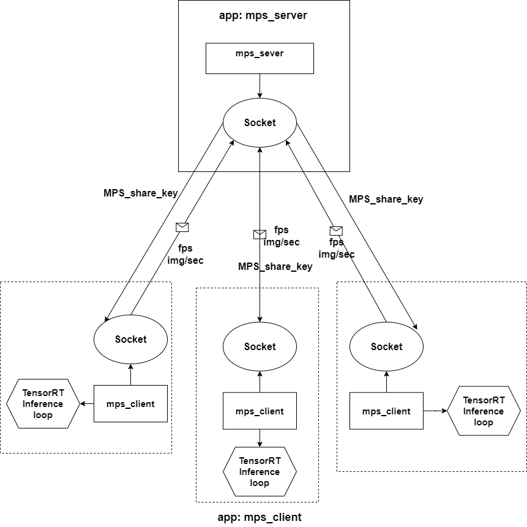

# MPS Sample for Drive Orin
[toc]
## Overview
This sample demonstrates how to enable Multi-Process Service (MPS) on Drive Orin to allow concurrent execution of CUDA kernels from different CUDA contexts on Orin iGPU.


This MPS enabling sample is added on an application that already supports to run following tasks in parallel within one CUDA context:
- Multiple TensorRT GPU inference instances
- Multiple TensorRT DLA inference instances
- Multiple CUDA kernels


## How to Enable MPS

The package includes two "*.diff" patch files:

***add_client_server.diff***: add two applications, mps_server and mps_client, without MPS enabled

***add_mps_support.diff***: add MPS-related changes to enable MPS for both mps_server and mps_client applications.
Refer to "add_mps_support.diff" for the necessary changes to enable MPS.

- **MPS on Primary CUDA context**
    - In the beginning of the process, call `etiEnableSharedPrimaryCtx` to enable primary contex as mps shared context
        ```c++
        etblSharedCtxFunc->etiEnableSharedPrimaryCtx(&shareKey, 0);
        ```
    - Call CUDA runtime api like `cudaSetDeviceFalgs` to create primary CUDA context
        In this sample, in `mps_utils.h`, we called:
        ```c++
        cudaSetDeviceFlags(cudaDeviceScheduleBlockingSync);
        ```

## Build and Run

### 1. Build
```bash
$ mkdir build && cd build
$ cmake .. && make
```
### 2. Preparation
Generate a TensorRT engine with trtexec
```bash
$ /usr/src/tensorrt/bin/trtexec --onnx=/usr/src/tensorrt/data/resnet50/ResNet50.onnx --int8 --saveEngine=ResNet50GPU.engine
$ /usr/src/tensorrt/bin/trtexec --onnx=/usr/src/tensorrt/data/resnet50/ResNet50.onnx --useDLACore=0 --fp16 --saveEngine=ResNet50DLA.engine  --allowGPUFallback
```
### 3. Run
The sample supports running with or without MPS, allowing users to compare performance.
#### Run with MPS
Terminal#1:
```bash
$ ./build/mps_server --mps
```
Terminal#2, #3, and more:
```bash
$ ./build/mps_client --mps --GPU=ResNet50GPU.engine,ResNet50GPU.engine --DLA_0=ResNet50DLA.engine --DLA_1=ResNet50DLA.engine --custom=CudaKernelTask
$ ./build/mps_client --mps --GPU=ResNet50GPU.engine,ResNet50GPU.engine --DLA_0=ResNet50DLA.engine --DLA_1=ResNet50DLA.engine --custom=CudaKernelTask
...
```
Performance data will be aggregated and displayed in Terminal#1


#### Run without MPS
Terminal#1:
```bash
$ ./build/mps_server
```
Terminal#2, #3, and more:
```bash
$ ./build/mps_client --mps --GPU=ResNet50GPU.engine,ResNet50GPU.engine --DLA_0=ResNet50DLA.engine --DLA_1=ResNet50DLA.engine --custom=CudaKernelTask
$ ./build/mps_client --mps --GPU=ResNet50GPU.engine,ResNet50GPU.engine --DLA_0=ResNet50DLA.engine --DLA_1=ResNet50DLA.engine --custom=CudaKernelTask
```
Performance data will be aggregated and displayed in Terminal#1:


## Additional Application Capabilities
1. The app also supports you to:
- Benchmark the TensorRT/GPU, TensorRT/DLA with multiple CUDA streams in one process(one CUDA context) 
- Benchmark the TensorRT/GPU, TensorRT/DLA in multiple processes without MPS
- Benchmark the TensorRT/GPU, TensorRT/DLA in multiple processes with MPS

2. With this app, you can simulate the multiple process Deep learning tasks arrangement with MPS

### Diagram

`file: mps_server.cpp, mps_client.cpp`




## Benchmark
- Testing device: Drive Orin-X, Drive OS 6.0.6.0
- Unit: img/sec

| model   | 2 process without MPS|      2 process with MPS        | 2 CUDA-streams in 1 CUDA-context  | MPS/stream|
|----------|:-------------:|------:|------:|------:|
|Resnet50_224_b1 |   1380    |    1498       |    1630   | 0.920|
|Resnet50_224_b8 |   3163    |    3192       |    3608   | 0.885|
|Resnet50_224_b16|   3640    |   3648        |    3955   | 0.922|
|Resnet50_224_b32|   3802    |   4064        |    4198   | 0.968|
|Resnet50_224_b64|   3939    |   4269        |    4366   | 0.978|
|yolov4_416_b1   |  254      |    297        |  300      | 0.990|
|yolov4_416_b8   |  373      |    416        |  416      | 1.000|
|yolov4_416_b16  |  387      |    430        |  432      | 0.995|
|yolov4_416_b32  |  397      |    441        |  445      | 0.991|
|yolov4_416_b64  |  403      |    446        |  451      | 0.990|

## Notes
### 1. CUDA_DEVICE_MAX_CONNECTIONS
Ensure the CUDA_DEVICE_MAX_CONNECTIONS is set to a value equal or larger than CUDA stream number (`$STREAM_NUM`) in the CUDA context. This can avoid initialization failures due to over-allocation of limited GPU resources, and the false dependencies among the CUDA streams, false dependencies could cause unexpected long CUDA syteam sync time.   
User can run `"export CUDA_DEVICE_MAX_CONNECTIONS=$STREAM_NUM"` under the **same** terminal of the application, or just call `setenv("CUDA_DEVICE_MAX_CONNECTIONS", "$STREAM_NUM, 1)` to set CUDA_DEVICE_MAX_CONNECTIONS, max value of CUDA_DEVICE_MAX_CONNECTIONS on Orin is 32.

### 2. MPS best practice
**MPS on Primary cuda context**(***RECOMMANDED***)
- the best way to use MPS is enabling the primary CUDA context to be a "MPS context", please call `etiEnableSharedPrimaryCtx` at the beginning of the process. By doing so, when you call a CUDA runtime API such as `cudaSetDeviceFlags` or `cudaFree`, the primary context will be created with MPS enabled.


**Create Explicited CUDA context**
- User can create and manage the MPS CUDA context by calling:
    ```c++
    etiSharedCtxCreate(&cuda_context, 0, &(mps_resource.createParams));
    ```


### 3. Others
- After enabling MPS, there will be only one CUDA context as you can find in nsys log since all the contexts running on MPS will be bound into one.
- MPS will not cause higher CPU utilization, if meet high CPU loading while `cudaStreamSynchronize`, Check the flags with `cudaGetDeviceFlags`.
- MPS only supports compute, so graphics context can't run on MPS now
- CUDA objects are CUDA context locally, sharing them accross CUDA contextes could cause error,e.g., cuda error 705 : `cudaErrorPeerAccessNotEnabled`
- MPS Shared key and Device key are different among processes
<!-- WE DO NOT SUGGEST USING EXPLICT MPS CONTEXT ANYMORE -->
<!-- - When using explicit created CUDA context mode, Use `cuDevicePrimaryCtxGetState` to get state of primary context for a device to debugging accidentally created primary CUDA context. -->
- User can check with nsight-system if there is GPU context switch inside the application, sample command
    ```bash
    nsys profile -t cuda,cudnn,osrt,nvtx --gpuctxsw true --duration=30 --accelerator-trace=tegra-accelerators --process-scope=system-wide ./build/mps_client --mps --GPU=ResNet50GPU.engine
    ```
<!-- SOLVED BY ENABLING PRIMARY CONTEXT AS MPS CONTEXT -->
<!-- - KNOWN ISSUE: cuDLA hybrid mode will create primary context while DLA runtime initializing. Suggestion is using cuDLA standalone mode instead. -->
