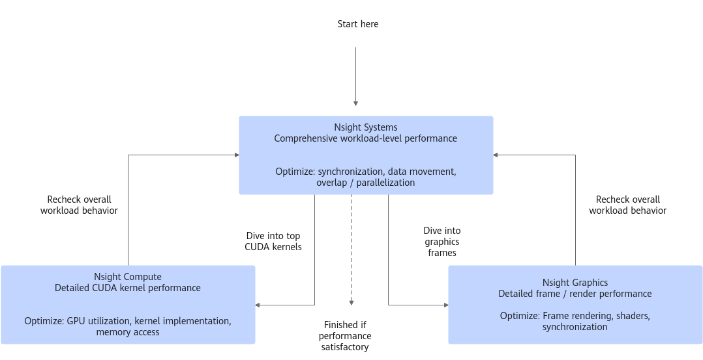
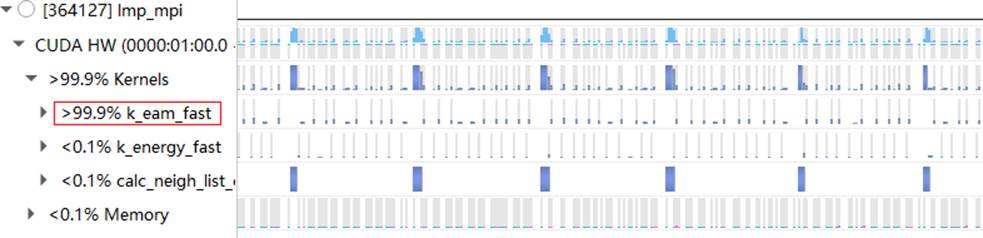
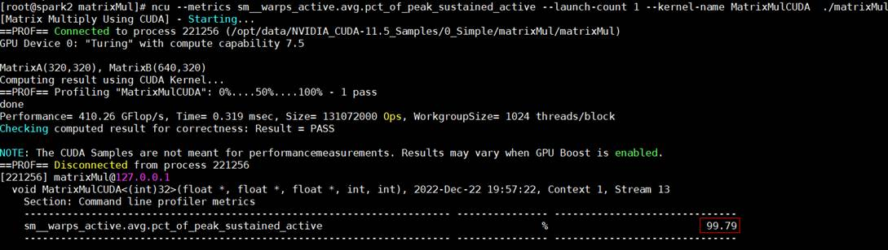
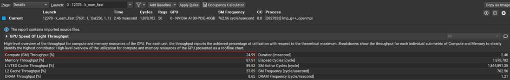
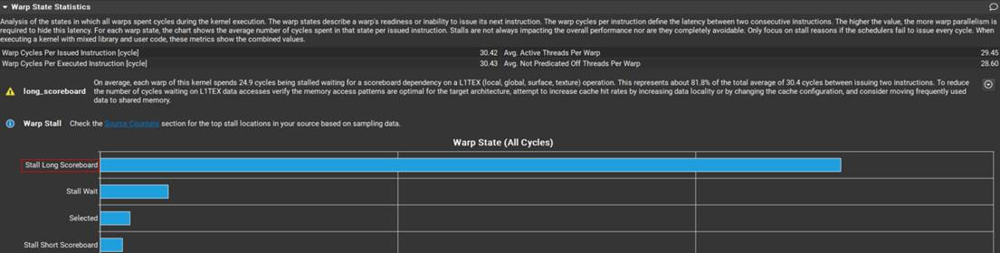
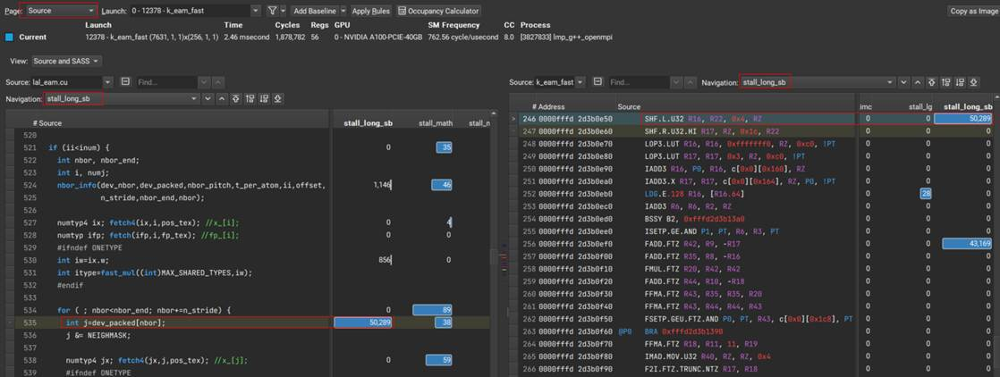

## 性能分析工具的使用

NVIDIA提供了专业的GPU性能分析工具，在性能优化领域常用的是Nsight Systems和Nsight Compute。

+ Nsight Systems可以提供系统级应用程序分析，从宏观上揭示应用的性能表现，利用Nsight Systems可以从时间线上一目了然地看到更多信息。它支持对整个系统、CPU、GPU、操作系统、运行时和工作负载本身的整体视图，应用的实际性能表现来源于多方面，而非局限于提升单个核函数运行效率。

+ Nsight Compute则可以针对单独的Kernel函数进行CUDA内核级分析。

性能分析工作流程如图1所示       
     
从Nsight Systems开始，获得应用的系统级概览，通过消除系统级瓶颈，例如不必要的线程同步或数据移动，并提高算法的系统级并行性。  

完成此操作后，继续使用Nsight Compute优化最重要的CUDA内核。定期返回Nsight Systems以确保始终专注于最大的性能瓶颈，否则瓶颈可能已经转移，此时再对核函数优化可能不会达到预期效果。    

### Nsight Systems使用     
+ 生成分析报告   
  ```bash
  nsys profile -y 1 -d 100 ./app
  nsys profile -y 1 -d 100 bash ./run_app.sh
  ```
  各参数含义：   
  ```
  -y：延时1s，开始采集
  -d：设定采集总时间，单位秒
  ```
  > 说明   
  > 在命令中增加--stats=true可以在采集结束之后查看系统概览。

+ 通过host x86-ui版本Nsight Systems软件导入刚生成的分析报告文件rep。
  > 说明
  Linux上的采集性能的Nsight Systems版本需要和 host-x86-ui版本一致。

+ 在Timeline view标签页查看CPU/GPU的运行时间分布，进而可以定位瓶颈位置。
  如下图2所示，kernel函数`k_eam_fast`明显最耗时，所以可以针对性地去分析优化该kernel代码。
  

  更详细的使用指导请参考文档：https://docs.nvidia.com/nsight-systems/index.html

### Nsight Compute使用     

+ 采集单个微架构相关指标数据    

+ 采集Warp占用率   
  ```bash  
  ncu --metrics sm__warps_active.avg.pct_of_peak_sustained_active --kernel-name k_eam_fast app  
  ```
  各参数含义：   
  ```
  --metrics：指定需要采集的性能指标
  --kernel-name k_eam_fast：只采集名为k_eam_fast核的指标，如不使用该参数则采集所有的核
  ```
       

  GPU微架构相关指标请参考：https://docs.nvidia.com/nsight-compute/NsightComputeCli/index.html#nvprof-metric-comparison

+ 采集全量指标数据  
  ```bash
  ncu --set full --import-source=yes --launch-skip 1000 --launch-count 1 --kernel-name k_eam_fast --export ncu-log app
  ```    

  执行后生成分析报告rep。
  各参数含义： 
  ```
  --set full：采集全部的指标数据，可使用ncu --list-sets列出Nsight Compute支持的所有性能分析配置集（sets）
  --import-source=yes：采集源码信息，前提条件是nvcc编译参数需要添加选项“-lineinfo”
  --launch-skip 1000：设定kernel启动前跳过初始化阶段的次数
  --launch-count 1：设定kernel启动的次数
  --export ncu-log：指定输出报告的文件名
  ```

+ 通过host-x86-ui版本Nsight Compute软件导入刚生成的分析报告文件。
+ 切换到Details标签页，查看如下信息。   
  |指标   | 含义  |  
  |----- |-------|    
  GPU Speed Of Light Throughput| 查看GPU计算和存储资源的整体使用情况|  
  |Compute Workload Analysis |查看SM（Streaming Multiprocessor）计算资源的使用情况，以及IPC（Instructions Per Cycle） |  
  |Memory Workload Analysis|查看各级存储的使用情况|   
  |Scheduler Statistics|查看Warp调度器发射指令的情况|      
  |Warp State Statistics|查看kernel执行期间Warp的状态信息|    
  |Instruction Statistics|查看SASS（Streaming Assembler）汇编指令组成和执行情况|    
  |Launch Statistics|查看kernel启动的资源配置情况（grid/block/thread/warp/register/shared memory）|
  |Occupancy|查看Warp占用率|

+ 切换到Source标签页，查看完整的CUDA源码、相关联的SASS汇编代码和PTX汇编代码，以及跟代码相关联的指标数据。
  基于此可以定位到具体哪些代码存在问题|    

更详细的使用指导请参考文档：https://docs.nvidia.com/nsight-compute/index.html

### 性能分析案例
对LAMMPS应用进行性能瓶颈分析。

+ 导入生成的分析报告到Nsight Compute软件    
  可以看出计算资源的吞吐较低。
       


+ 查看Compute Workload Analysis和Warp State Statistics，如下图描述各个warp stall根因的占比   
  可以看出“Stall Long Scoreboard”是导致warp stall的主要原因。
      

+ 切换到“Source”标签页查看具体哪些代码导致Stall Long Scoreboard，进而去优化这些代码的执行方式   
       

  Stall Long Scoreboard的意思是下一条指令的执行依赖于L1TEX (local, global, surface, tex)数据的到来。

解决思路：**可以通过增加数据局部性来提高cache命中，或者将频繁使用的数据移至shared memory中**。

关于Warp Scheduler State的描述请参考：https://docs.nvidia.com/nsight-compute/2022.2/ProfilingGuide/index.html#statistical-sampler
