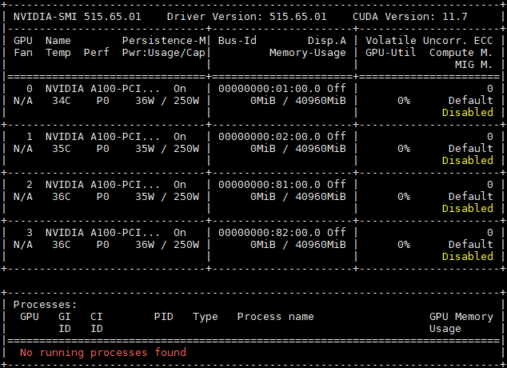
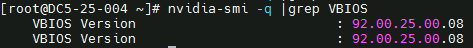
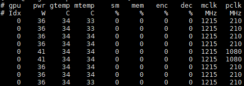

## 硬件优化手段

NVIDIA GPU具有很强的计算能力，但同时功耗高，产生的热量多，对服务器的功率和散热有很高的要求

+ 选择更强的硬件
  NVIDIA A100显卡具有多种性能，不同硬件具有不同的功耗限制、显存大小，可根据不同的计算需要选择不同的硬件设备。如果计算时功率过早达到上限，可将功率上限250W的设备更换为300W的硬件设备。

+ 选择PCIe x16插槽
  选择PCIe x16的Riser卡相对PCIe x8 可获得更大的PCIe带宽   

+ 连接电源线
  NVIDIA GPU通过PCIe插槽连接到Riser卡，此外需要连接电源线保证电源供电  

+ 设置服务器功率
  由于GPU计算要求功率较高，服务器最好选用2个900W以上电源保证供电，电源模式选择负载均衡。同时在计算时不设置功率封顶，避免影响性能   

+ 调节风扇转速
  在风扇选择上，可选择风力更强的风扇来保证散热，同时需要将风扇转速调至最大   
  + SSH登录iBMC  
    ```bash
    ssh Administrator@IP
    ```     
  + 配置风扇转速手段设置模式    
    ```bash
    ipmcset -d fanmode -v 1 0
    ```       
  + 将4组风扇转速均调至100%  
    ```bash
    ipmcset -d fanlevel -v 100 2 
    ipmcset -d fanlevel -v 100 1 
    ipmcset -d fanlevel -v 100 4 
    ipmcset -d fanlevel -v 100 3
    ```    

+ 调节GPU运行模式   
  nvidia-smi是一个跨平台GPU监控工具，它支持所有标准的NVIDIA驱动程序支持的Linux发行版，提供监控GPU使用情况和更改GPU状态的功能。该工具是显卡驱动附带的，只要安装好驱动后就可以使用   
  查询所有GPU的当前信息   
  

  常见功能及其解释如表1所示      
  |指标  | 含义 | 配置方式 |   
  |---  | ---- | ------  |   
  |Fan|表示风扇转速，从0到100%之间变动，这个速度是计算机期望的风扇转速，实际情况下如果风扇堵转，可能达不到显示的转速。有的设备不会返回转速，因为它不依赖风扇冷却而是通过其他外设保持低温|参考调节风扇转速调节风扇转速|      
  |Temp|温度，单位摄氏度|无法调节|         
  |Perf|性能状态，从P0到P12，P0表示最大性能，P12表示状态最小性能|无法调节|      
  |Pwr|代表能耗，代表GPU的实时能耗和最大能耗|无法调节|     
  |Persistence-M|是持续模式的状态，持续模式虽然耗能大，但是在新的GPU应用启动时，花费的时间更少，这里显示的是on的状态|建议开启GPU的持久模式。GPU默认持久模式关闭的时候，GPU如果负载低，会休眠。之后唤起的时候，有一定几率失败。|执行以下命令开启持久模式 nvidia-smi -pm 1|      
  |Bus-Id|GPU总线ID，依次代表`domain:bus:device.function`|无法调节|    
  |Disp.A|Display Active， GPU是否正在用于连接显示器（即显卡输出画面）|无法调节|    
  |Memory Usage|代表显存使用率|无法调节|      
  |GPU Util|代表浮动的GPU利用率，对应流处理器的利用率|无法调节|
  |ECC|是否启用了ECC（Error Correcting Code）内存纠错功能|切换ECC支持 <br>nvidia-smi -e 0/1 <br>其中：<br>0代表DISABLED，1代表ENABLED。<br>重置ECC错误计数nvidia-smi -p 0/1 <br>其中：<br>0代表VOLATILE ，1代表AGGREGATE|
  |Compute M|代表计算运行模式|切换计算运行模式 <br>nvidia-smi -c 0/1/2 <br>其中：<br>0代表Default，1代表Exclusive_Process，2代表Prohibited|

  最下面区域表示每个进程占用的显存使用率。还有一些指标无法上述回显信息中得出，但是对性能的影响比较大   

+ 设置GPU工作频率，如下为设置GPU的显存频率（Memory Clock）为1215MHz，图形频率（Graphics Clock）为1410MHz    
  ```bash
  nvidia-smi -ac 1215,1410
  ```
+ 设置GPU最大图形频率，将前两个GPU的最大图形频率限制为1410MHz   
  ```bash
  nvidia-smi -lgc 1410,1410
  ```
  确保所有GPU的固件版本一致，否则可能影响性能    
  ```bash
  nvidia-smi -q |grep -i VBIOS
  ```
  

+ 为了实时查看GPU的详细信息，可以使用`nvidia-smi dmon`命令   
  GPU统计信息以一行的滚动格式显示，要监控的指标可以基于终端窗口的宽度进行调整。 监控最多4个GPU，如果没有指定任何GPU，则默认监控GPU0-GPU3（GPU索引从0开始）    
  

  表2 nvidia-smi dmon附加选项

  |命令|功能|    
  |----|-----------|   
  |nvidia-smi dmon -i xxx|用逗号分隔GPU索引，PCI总线ID或UUID|     
  |nvidia-smi dmon -d xxx|指定刷新时间（默认为1秒）|       
  |nvidia-smi dmon -c xxx|显示指定数目的统计信息并退出|      
  |nvidia-smi dmon -s xxx|指定显示哪些监控指标（默认为puc），其中：<br>p：电源使用情况和温度（pwr：功耗，temp：温度）。<br>u：GPU使用率（sm：流处理器，mem：显存，enc：编码资源，dec：解码资源）<br>c：GPU处理器和GPU内存时钟频率（mclk：显存频率，pclk：处理器频率）<br>v：电源和热力异常 <br>m：FB内存和Bar1内存 <br>e：ECC错误和PCIe重显错误个数 <br>t：PCIe读写带宽 |        
  |nvidia-smi dmon -o D/T|指定显示的时间格式D：YYYYMMDD，T：HH:MM:SS |    
  |nvidia-smi dmon -f xxx|将查询的信息输出到具体的文件中，不在终端显示|       

+ 很多情况下设备监控可参考的价值不高，这时就要监控GPU进程，监控命令`nvidia-smi pmon`，以滚动条形式显示GPU进程状态信息，常用的附件选项如表3所示     
  表3 nvidia-smi pmon附加选项     
  |命令|功能|    
  |----|-----------|    
  |nvidia-smi pmon -i xxx|用逗号分隔GPU索引，PCI总线ID或UUID|      
  |nvidia-smi pmon -d xxx|指定刷新时间（默认为1秒）|    
  |nvidia-smi pmon -c xxx|显示指定数目的统计信息并退出|      
  |nvidia-smi pmon -s xxx|指定显示哪些监控指标（默认为u），其中：<br>u：GPU使用率<br>m：FB内存使用情况|      
  |nvidia-smi pmon -o D/T|指定显示的时间格式D：YYYYMMDD，T：HH:MM:SS|
  |nvidia-smi pmon -f xxx|将查询的信息输出到具体的文件中，不在终端显示|

+ 配置风道及改善散热
  散热对GPU性能影响很大，在计算时可将前面板的磁盘拔出，让风扇获得更大的进风量。如果有多张卡，那么在卡槽间均匀配置GPU卡会有一定的性能收益    


## 服务器端配置   
+ 配置电源模式   
  默认值：custom
  将电源模式调至Performance模式，保证计算时CPU频率保持峰值不变  

+ 配置内存刷新率
  默认值：32ms
  将内存刷新频率调至Auto，多数情况内存刷新以64ms运行，减少对内存使用的干扰  

+ 调整CPU硬件预取
  默认值：Enabled    
  GPU计算场景内存访问多是顺序的，打开预取有利于性能提升   

+ 关闭SMMU
  默认值：Enabled      
  开启SMMU后内存访问会经过MMU模块地址转换，对性能存在影响，建议关闭     

## OS 端配置    
  开启透明大页       
  CPU与GPU之间交互时有大量的内存数据拷贝，透明大页可为应用分配大页内存，减少tlb消耗，提升性能
  ```bash
  echo always > /sys/kernel/mm/transparent_hugepage/enabled 
  echo always > /sys/kernel/mm/transparent_hugepage/defrag
  ```

----------

## DDR     

GDDR 双倍数据速率 DDR：为何时钟**上升沿+下降沿**都传数据  

### 1. 基础：SDR（单速率，普通SRAM）  
普通单速率内存 SDR：
- 只在**时钟上升沿**采样/发送1组数据   
- 1个完整时钟周期（1个高电平+1个低电平），只传输1次数据  

举例：时钟频率 1GHz
周期 = 1ns，每1ns 传1批数据，**每周期1次传输**   

### 2. DDR 核心定义：Dual Data Rate 双倍速率
DDR 内存（GDDR、DDR4/5、LPDDR）标准设计：
> **时钟上升沿、时钟下降沿，各传输一次数据**
1 个完整时钟周期，**2次数据传输**，等效带宽直接翻倍。

### 时钟波形拆解（一个完整周期）    
1. **上升沿**：电压从低→高瞬间 → 传输第一组数据
2. **高电平保持阶段**
3. **下降沿**：电压从高→低瞬间 → 传输第二组数据
4. **低电平保持阶段**
完成一轮时钟，输出两份数据。

### 3. 为什么选“上下沿”，不直接加倍时钟？     
### 方案A：单纯提升时钟频率（不使用DDR）
想要2倍带宽，只能把时钟频率翻倍：
- 芯片电路切换频率翻倍，功耗、发热暴涨
- 高频信号极易产生信号反射、串扰、时序失真，PCB/显存硬件设计难度指数上升
- 显存颗粒、GPU内存控制器工艺上限受限，频率不能无限拉高

### 方案B：DDR 双沿采样（工业最优折中）   
时钟频率不变，**利用现有时钟波形的两个跳变边沿**分别传数据：
1. 物理时钟频率不变，硬件压力、信号干扰、功耗基本不变
2. 只修改控制器逻辑，在上升、下降两个跳变点分别锁存数据
3. 等效数据吞吐量直接 ×2，性价比极高

### 4. 套入你代码里的带宽公式解释
```
2.0f * memoryClockRate * (busWidth / 8) / 1e6
```
这里的 `2.0f` 就是补偿 DDR 双沿传输的双倍系数：
- `memoryClockRate`：显存物理时钟（kHz）
- 若无DDR，带宽 = 时钟频率 × 位宽/8
- GDDR 在同一个时钟周期传2次数据，因此整体 ×2

举个直观例子：
显存时钟 1750 MHz，320bit位宽
- SDR 理论带宽 = 1750M × (320/8) = 70000 MB/s
- GDDR（DDR双沿）= 2 × 1750M × 40 = 140000 MB/s = 140 GB/s

### 5. GDDR (Graphics DDR) 与普通DDR细微区别
GDDR5/6/6X 同样遵循**双沿传输**基础规则，额外增加：
- 多通道并行架构
- GDDR6X 使用 PAM4 4电平信号，单沿一次传2bit，再次翻倍带宽
但底层基础双倍速率逻辑，依然是**时钟上下双沿传输**。

时钟信号天然有上升、下降两个电压跳变点，DDR/GDDR 把两个边沿都用来收发数据，不用拉高硬件时钟频率，就能直接翻倍显存吞吐带宽。

