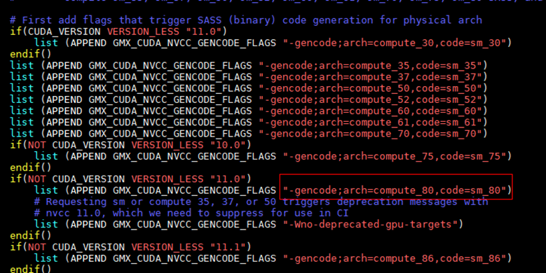

# 编译器优化   

## NVCC编译参数优化

当前已知对GPU计算性能影响较大的编译选项如表1所示，可在编译时添加。
表1 NVCC编译参数       
|编译选项|选项描述|   
|------|--------|   
|`-gencode;arch=compute_xx,code=sm_xx`|指定对应GPU卡类型和架构，以获取更好的兼容性和性能，比如A100的典型配置为 `-gencode;arch=compute_80,code=sm_80`|        
|`--ftz=false/true`|是否将极小值置为0，减少计算，默认false|    
|`--prec-sqrt=true/false`|是否使用精确的平方根函数，默认true|    
|`--prec-div=true/false`|是否使用精确的除法计算，默认true|    
|`--fmad=true/false`|是否使能乘加合并计算，默认true|     
|`--use_fast_math`|是否开启快速计算模式，开启时相当于`--ftz=true --prec-div=false --prec-sqrt=false --fmad=true`|      
|`-O 0 1 2 3 4`   |代码优化级别，O0为不优化，O1到O4优化操作逐渐增多，建议O4|   
|`-Xptxas -allow-expensive-optimizations`|用最大资源来实现优化|
|`-Xptxas -dlcm=ca/cg`|是否开启L1 cache，ca为开启，cg为关闭，默认ca|           

## Case    

NVIDIA发布的2021.4版本GROMACS，该版本相比2019版本增加了对A100 GPU卡code=sm_80的适配，能取得更好的性能，性能提升约5%。如下图所示。
   

## NVC/NVC++/NVFORTRAN编译参数优化      
NVC/NVC++/NVFORTRAN编译参数如表1所示，可在编译时添加。     
表2 NVC/NVC++/NVFORTRAN编译参数
|编译选项|选项描述|   
|------|--------|     
|-Mcache_align|cache字节对齐|    
|-Mfpapprox|使用低精度行为执行除、平方根等操作|      
|-Mautoinline|配置自动化内联的参数|    
|-Minline|让多次调用的简单函数内联化|    
|-Mipa|进行过程分析优化|    
|-Munroll|循环展开|      
|-fast|使能向量化、cache对齐、FTZ等内容|     
|-gpu=fastmath|指定GPU选项使用快速数学库|     
|-gpu=flushz|指定GPU选项打开FTZ|    
|-O 0 1 2 3 4|代码优化级别，建议O4|      

参考文档：《NVIDIA HPC Compilers Reference Guide》
