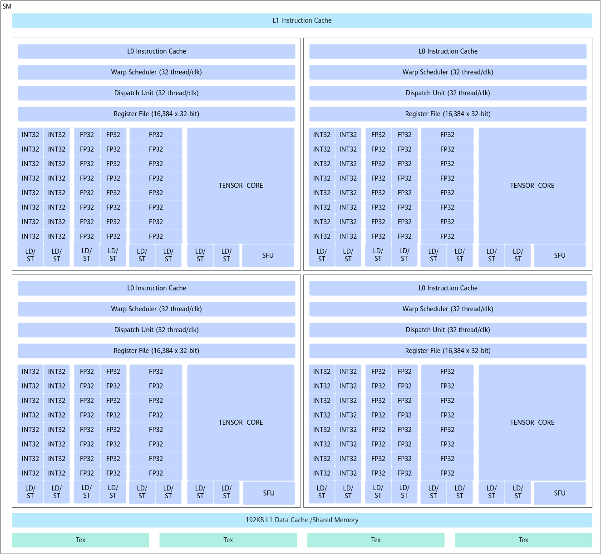
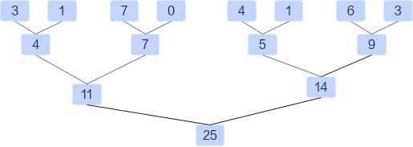
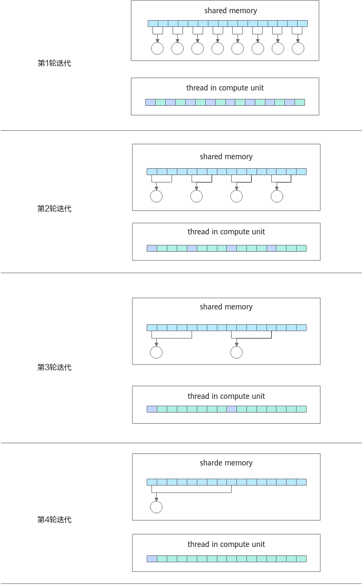
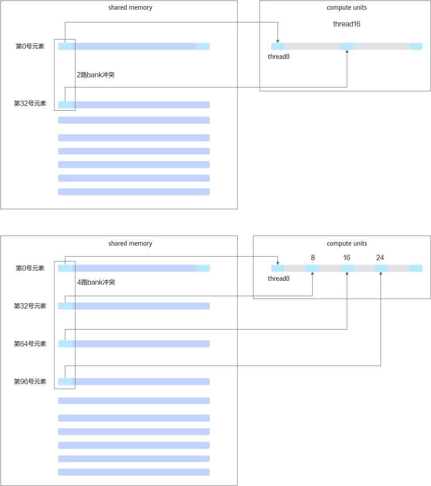
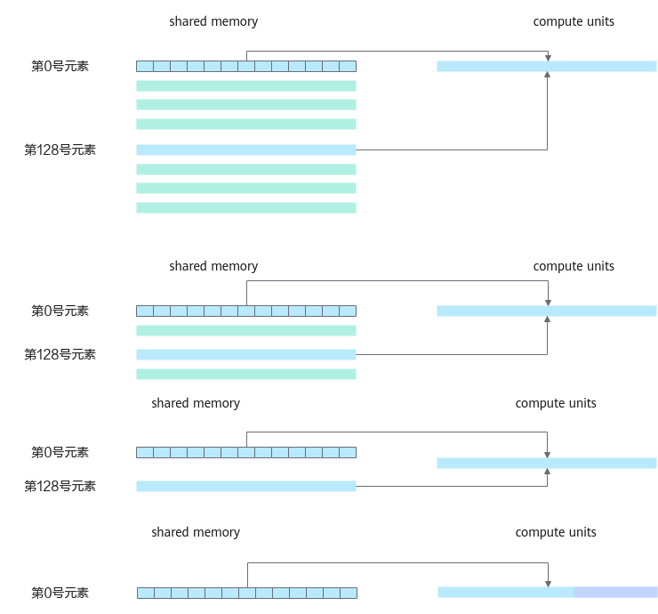

# kernel代码优化

## 最大化GPU利用率
 
+ 应用层面     
  使用异步API 和流，最大化主机端（host）任务、设备端（device）任务和主机设备通信任务的并行性。   

  ```c
  cudaStream_t stream[2];
  for (int i = 0; i < 2; ++i) {
      cudaStreamCreate(&stream[i]);
  }

  float *hostPtr;
  cudaMallocHost(&hostPtr, 2 * size);

  for (int i = 0; i < 2; ++i) {
      cudaMemcpyAsync(inputDevPtr + i * size, hostPtr + i * size, size, cudaMemcpyHostToDevice, stream[i]);
      MyKernel<<<100, 512, 0, stream[i]>>>(outputDevPtr + i * size, inputDevPtr + i * size, size);
      cudaMemcpyAsync(hostPtr + i * size, outputDevPtr + i * size, size, cudaMemcpyDeviceToHost, stream[i]);
  }

  for (int i = 0; i < 2; ++i) {
      cudaStreamDestroy(stream[i]);
  }
  ```

  在上面的例子中如果使用 cudaMemcpy，CPU会阻塞直到主机内存拷贝完毕，但是使用 cudaMemcpyAsync，程序会继续执行，也就是说CPU在内存传输时可以继续工作。这里使用了**CUDA流**技术，通过`将数据拷贝与内核计算操作提交到不同的流中`，实现异步并发执行。  

  例如，一个流可同时负责将主机数据异步传输至GPU内存，而另一个流则在GPU上并行执行计算任务。当计算完成后，结果可异步回传至主机内存。这种多流并发调度机制，有效实现了**数据传输与计算的重叠**，显著提升了GPU利用率和程序整体性能。如果kernel比较小，那这种模式可以充分利用GPU，如果不指定流，默认会安排在0号流中排队执行，如果指定了流，就可以提高并行效率。在以下的例子中，如果所有操作都是1s内就可以完成，那么运行时间都是一致的。

  现在大部分系统CPU和GPU都是通过PCIe进行通信的，少部分会使用NVLink，通信的代价通常比较高，如果能够异步地进行传输可以提升效率。

  以下代码示例创建了两个流，每个流都用来作为主机内存拷贝到设备以及设备内存拷贝到主机的并行操作。
  ```c
  cudastream_t s1，s2;
  cudastreamCreate(&s1); cudaStreamCreate(&s2):

  //# 执行3s
  cudaMemcpy(&d_arr, &h._arr,numbytes,cudaH2D);
  A<<<1,128>>>(d_arr);
  cudaMemcpy(&h_arr,&d_arr，numbytes，cudaD2H);

  //# 执行3s
  cudaMemcpyAsync(&d_arr，&h_arr，numbytes，cudaH2D, s1);
  A<<<1,128, s1>>>(d_arr);
  cudaMemcpyAsync(&h_arr,&d_arr, numbytes,cudaD2H,s1);

  //# 执行3s
  cudaMemcpyAsync(&d_arr1,&h_arr1, numbytes，cudaH2D，s1);
  A<<<1, 128, s1>>>(d_arr1);
  cudaMemcpyAsync(&h_arr1,&d_arr1, numbytes, cudaD2H, s1);
  cudaMemcpyAsync(&d_arr2,&h_arr2, numbytes，cudaH2D，s2);
  B<<<1,192, s2>>>(d_arr2);
  cudaMemcpyAsync(&h-arr2,d_arr2，numbytes，cudaD2H, cudaH2D, s1);

  //# 执行3s
  cudaMemcpyAsync(&d_arr1,&h_arr1，numbytes，cudaH2D,s1);  
  cudaMemcpyAsync(&d_arr2,&h_arr2, numbytes , cudaH2D,s2);  
  A<<<1,128,s1>>>(d_arr1);
  B<<<1,192,s2>>>(d_arr2);
  cudaMemcpyAsync(&h_arr1,&d_arr1,numbytes，cudaD2H，s1);
  cudaMemcpyAsync(&h_arr2,&d_arr2，numbytes, cudaD2H，s2); 
  ```

+ 设备层面   
  将没有数据依赖，可并行的kernel使用流加速    

+ 多线程层面    
  编写 kernel代码时 **谨慎使用寄存器和共享内存**，防止影响占有率（occupancy）       

  A100每个SM上面的占有率有如下受限因素：     
  + 线程块数量2个
  + 每个线程块中最多运行的线程数量1024
  + 所有线程块共享的寄存器个数65536
  + 共享内存大小20KB
  + block大小应该为Warp的倍数


对于GPU而言，如果一个线程被分配更多的work时，可能会更好地覆盖延时。如果线程有更多的work时，对于编译器而言，就可能有更多的机会对相关指令进行重排，从而去覆盖访存时的巨大延时。因此**block大小设置为Warp的倍数**，可以充分发挥GPU的性能。grid 设置呢？ 自动适配 SM 数量，凑倍数 Grid  


## 最大化GPU内存吞吐量

  也可以理解为**运行时实测的有效带宽**。 
  寄存器、Shared Memory、L1 Cache 之间的数据交换，不走全局显存总线，不计入 Global Memory 吞吐量。     
  只有 global 空间读写才会统计进去。kernel 真实运行期间，GPU 与 Global Memory 之间每秒搬运的有效字节数。    
  ```bash
  #include <iostream>
  #include <cuda_runtime.h>

  // CUDA 错误检查封装宏    
  #define CHECK_CUDA_ERR(err) \
  do {                          \
      cudaError_t ret = (err);  \
      if (ret != cudaSuccess) { \
          std::cerr << "CUDA Error: " << cudaGetErrorString(ret) \
                    << " at line " << __LINE__ << std::endl;     \
          exit(EXIT_FAILURE); \
      } \
  } while(0)

  int main() {
      int device_id{0};
      CHECK_CUDA_ERR(cudaGetDevice(&device_id));

      cudaDeviceProp device_prop;
      CHECK_CUDA_ERR(cudaGetDeviceProperties(&device_prop, device_id));

      std::cout << "=== GPU Device Info ===" << std::endl;
      std::cout << "Device Name: " << device_prop.name << std::endl;

      // 显存大小：二进制 GiB (1024^3)
      float mem_gib = static_cast<float>(device_prop.totalGlobalMem) / (1ULL << 30);
      std::cout << "Total Global Memory: " << mem_gib << " GiB" << std::endl;
      // 可选：十进制 GB (厂商标称)
      float mem_gb = static_cast<float>(device_prop.totalGlobalMem) / 1e9;
      std::cout << "Total Global Memory (Vendor GB): " << mem_gb << " GB" << std::endl;

      // GiB = 1024³ Byte,   GB = 1000³ Byte
      // 峰值显存带宽计算  GDDR 双倍数据速率（DDR， Dual Data Rate），上下沿同时传输
      // 时钟上升沿、时钟下降沿，各传输一次数据; 1 个完整时钟周期，2 次数据传输，等效带宽直接翻倍。
      // memoryClockRate: kHz, busWidth: *2 DDR, bit / 8 → Byte, /1e6 → GB/s
      float peak_bandwidth = 2.0f * static_cast<float>(device_prop.memoryClockRate)
                          * (device_prop.memoryBusWidth / 8.0f) / 1.0e6f;
      std::cout << "Peak Memory Bandwidth: " << peak_bandwidth << " GB/s" << std::endl;

      return 0;
  }
  ```

  GPU内存的利用方式对GPU的性能影响很大，因此需要最大程度减少对内存的访问，GPU的内存模型如图1所示。    
  

  其中最重要的就是尽可能**合并全局内存访问的时间**，因为不同的内存性能差距比较明显，参考如下优化思路：     

  + 尽量使用 `page-locked(pinned)` 内存     
    相当于单独在CPU上开辟了一块固定内存，当GPU需要数据时，直接从锁页内存中复制，可使用cudaHostAlloc、cudaHostRegister等函数   

  + 尽可能的减少host和device之间的内存传输    
    将多次传输合并为一次大传输    
    可以将一些并行度不高但是需要H-D传输的任务放到GPU上    

  + 访问全局内存时，要考虑对齐问题   
    如果没有正确的对齐，读写将被编译器拆分为多次操作，降低访存性能     

    一维数据使用`cudaMalloc()`开辟GPU全局内存空间，多维数据建议使用`cudaMallocPitch()`建立内存空间，以保证段对齐。cudaMallocPitch函数分配的内存中，数组的每一行的第一个元素的开始地址都保证是对齐的。因为每行有多少个数据是不确定的，cudaMallocPitch在分配内存时，每行会多分配一些字节（padding对齐），以保证x方向元素个数*sizeof（元素）+多分配的字节是256的倍数（对齐）。

  + 不要把kernel中的变量放到local Memory中     
    尽可能减少每个线程的内存操作次数，注意这个方法不一定有用，因为在有的情况下需要将数据快速复制到shared Memory，然后复制回去，这样虽然总内存操作增多了，但是访存时间下降了。

    比如求解数组平方和的案例，当一个thread在等待内存数据的时候，GPU就会切换到下一个thread。  
    所以，实际执行的顺序类似于 `thread0 --> thread1 --> ... ... --> threadn`，这就导致了同一个thread在读取内存是连续的，但是对于整体而言，执行的过程中内存读取就不是连续的。

    ```c
    __global__ static void squaresSum(int *data, int *sum, clock_t *time) {
        const int size = DATA_SIZE / THREAD_NUM;
        const int tid = threadIdx.x;
        int tmp_sum = 0;
        clock_t start;
        if (tid == 0) start = clock();

        for (int i = tid * size; i < (tid + 1) * size; i++) {
            tmp_sum += data[i] * data[i];
        }
        sum[tid] = tmp_sum;

        if (tid == 0) *time = clock() - start;
    }
    ```

    如果在读取数组data时，能够做到每隔N个线程读取一次，所有的内存操作都会统一，GPU线程就不会出现切换，大大减少了开销。下面的代码实测比上面的代码性能提升15倍。

    ```c
    __global__ static void squaresSum(int *data, int *sum, clock_t *time) {
    const int size = DATA_SIZE / THREAD_NUM;
        const int tid = threadIdx.x;
        int tmp_sum = 0;
        clock_t start;
        if (tid == 0) start = clock();

        for (int i = tid; i < DATA_SIZE; i += THREAD_NUM) {
          tmp_sum += data[i] * data[i];
        }
        sum[tid] = tmp_sum;

        if (tid == 0) *time = clock() - start;
    }
    ```

  + 避免线程发散（thread divergence），GPU相邻线程执行相同的操作效率会更高    
    比如常用的reduce操作，假设给定一个长度为N的数组，需要计算该数组的所有元素之和，算法比较简单，分为三个步骤    
    + 将数据load至shared memory中   
    + 在shared memory中对数据进行reduce操作   
    + 将最后的结果写回global memory中   

    

    ```c
    __global__ void reduce(float *d_in,float *d_out) {
        __shared__ float sdata[THREAD_PER_BLOCK];

        //each thread loads one element from global memory to shared mem
        unsigned int i=blockIdx.x*blockDim.x+threadIdx.x;
        unsigned int tid=threadIdx.x;
        sdata[tid]=d_in[i];
        __syncthreads();

        // do reduction in shared mem
        for (unsigned int s=1; s<blockDim.x; s*=2) {
            if (tid%(2*s) == 0) {
                sdata[tid]+=sdata[tid+s];
            }
            __syncthreads();
        }

        // write result for this block to global mem
        if (tid==0) d_out[blockIdx.x]=sdata[tid];
    }
    ```

    以每个线程块中包含256个线程为例(THREAD_PER_BLOCK=256)，首先256个线程分为8组Warp，每组32个线程，第tid号线程将i号数据从global memory取出放到shared memory中，接下来开始迭代操作：

    ```
    第1轮迭代：如果tid%2 ==0，则第tid号线程将shared memory中第tid号位置的值和第tid+1号的值进行相加，而后放在第tid号位置。   
    第2轮迭代：如果tid%4==0，则第tid号线程将shared memory中第tid号位置的值和第tid+2号的值进行相加，而后放在第tid号位置。    
    不断迭代，直到所有元素都被累加到第0号位置。   
    ```

    

    目前上述代码存在的最大问题就是Warp divergent的问题。对于一个block而言，它所有的thread都是执行同一条指令。如果存在if-else这样的分支情况的话，thread会执行所有的分支。只是不满足条件的分支，所产生的结果不会记录下来。可以在上图中看到，在每一轮迭代中都会产生两个分支，分别是紫色和绿色的分支。这严重影响了代码执行的效率。如果能尽可能地让所有线程走到同一个分支里面效率应当会提高。

    优化后：

    ```c
    __global__ void reduce1(float *d_in,float *d_out) {
        __shared__ float sdata[THREAD_PER_BLOCK];

        //each thread loads one element from global memory to shared mem
        unsigned int i=blockIdx.x*blockDim.x+threadIdx.x;
        unsigned int tid=threadIdx.x;
        sdata[tid]=d_in[i];
        __syncthreads();

        // do reduction in shared mem
        for(unsigned int s=1; s<blockDim.x; s*=2) {
            int index = 2*s*tid;
            if(index < blockDim.x) {
                sdata[index]+=sdata[index+s];
            }
            __syncthreads();
        }

        // write result for this block to global mem
        if(tid==0)d_out[blockIdx.x]=sdata[tid];
    }
    ```

    虽然代码依旧存在着if语句，但是却与之前的代码有所不同。继续假定block中存在256个thread，即拥有256/32=8个Warp。

    ```
    当进行第1次迭代时，0~3号Warp的index<blockDim.x，4~7号Warp的index>=blockDim.x。对于每个Warp而言，都只是进入到一个分支内，所以并不会存在Warp divergence的情况   
    当进行第2次迭代时，0、1号两个Warp进入计算分支     
    当进行第3次迭代时，只有0号Warp进入计算分支    
    当进行第4次迭代时，只有0号Warp的前16个线程进入分支。此时开始产生Warp divergence。通过这种方式，消除了前3次迭代的Warp divergence。
    ```

  + 使用shared Memory时，防止bank conflict      
    reduce1的最大问题是bank冲突。我们把目光聚焦在这个for循环中。并且只聚焦在0号Warp。     

    在第一次迭代中，0号线程需要去load shared memory的0号地址以及1号地址的数，然后写回到0号地址。而此时，这个Warp中的16号线程，需要去load shared memory中的32号地址和33号地址。可以发现，0号地址跟32号地址产生了2路的bank冲突。    

    在第2次迭代中，0号线程需要去load shared memory中的0号地址和2号地址。这个Warp中的8号线程需要load shared memory中的32号地址以及34号地址，16号线程需要load shared memory中的64号地址和68号地址，24号线程需要load shared memory中的96号地址和100号地址。又因为0、32、64、96号地址对应着同一个bank，所以此时产生了4路的bank冲突。

    现在，可以继续算下去，8路bank冲突，16路bank冲突。由于bank冲突，所以reduce1性能受限。下图说明了在load第一个数据时所产生的bank冲突。
    


    解决bank冲突的方式就是把for循环逆着来。原来stride从0到256，现在stride从128到0。
    ```c
    __global__ void reduce2(float *d_in,float *d_out) {
        __shared__ float sdata[THREAD_PER_BLOCK];

        //each thread loads one element from global memory to shared mem
        unsigned int i=blockIdx.x*blockDim.x+threadIdx.x;
        unsigned int tid=threadIdx.x;
        sdata[tid]=d_in[i];
        __syncthreads();

        // do reduction in shared mem
        for(unsigned int s=blockDim.x/2; s>0; s>>=1) {
            if(tid < s){
                sdata[tid]+=sdata[tid+s];
            }
            __syncthreads();
        }

        // write result for this block to global mem
        if(tid==0) d_out[blockIdx.x]=sdata[tid];
    }
    ```
    继续分析如何通过一个小小的改变就能消除bank冲突。
    ```
    首先，注意这个for循环，并且只分析0号Warp。0号线程需要load shared memory的0号元素以及128号元素。1号线程需要load shared memory中的1号元素和129号元素。这一轮迭代中，在读取第一个数时，Warp中的32个线程刚好load一行shared memory数据。

    再分析第2轮迭代，0号线程load 0号元素和64号元素，1号线程load 1号元素和65号元素，每个线程load shared memory的一行。

    再分析第3轮迭代，0号线程load 0号元素和32号元素，以此类推，一个线程load shared memory的一行，没有bank冲突。

    到了4轮迭代，0号线程load 0号元素和16号元素。
    ```

    迭代示意图如下。
    
    

    更多reduce函数优化请参考：   
    https://github.com/Liu-xiandong/How_to_optimize_in_GPU    
    http://developer.download.nvidia.com/compute/cuda/1.1-Beta/x86_website/projects/reduction/doc/reduction.pdf   

  + 尽可能连续的访问全局内存   
    比如启动 `N*N` 个线程计算两个N*N矩阵的乘积，结果矩阵的每个值使用下述公式计算：     
    $C_{ij} = \sum_{k=1}^{N} A_{ik}B_{kj}$    

    在计算Cij过程中，Bkj涉及非连续数据的访问，影响访存效率，此时可以引入矩阵BT，使得数据连续访问：   
    $C_{ij} = \sum_{k=1}^{N} A_{ik} B_{jk}^T$

    优化前：每个线程只计算1个元素，B数组非连续访问。
    ```c   
    __global__ void matrix_mul_gpu(int n, float *a, float*b, float*c) {
      const int bid = blockIdx.x;
      const int tid = threadIdx.x;
      float s = 0.0;
      for (int k = 0; k < n; ++k)
        s += a[bid*n + k] * b[k*n + tid];               //A(i,k)*B(k,j)

      c[bid*n+tid] = s;
    }
    ```
    优化后：A，B矩阵均连续访问，相比优化前实现了30%性能提升。 

    ```c
    __global__ void transpose(int n, float *b, float *bt) {
      bt[blockIdx.x*n + threadIdx.x] = b[threadIdx.x*n + blockIdx.x];
    }
    __global__ void matrix_mul_gpu_opt(int n, float *a, float*b, float*c) {
      const int bid = blockIdx.x;
      const int tid = threadIdx.x;
      float s = 0.0;
      for (int k = 0; k < n; ++k)
        s+= a[bid*n + k] * b[tid*n + k];                //A*BT  连续访问

      c[bid*n + tid] = s;
    }
    ```

## 最大化指令吞吐量

**算术强度**本质上是指访问内存所花的时间内做的数学运算次数，所以要最大化算术强度，可参考如下优化思路：

尽量**少使用低吞吐量的算术指令， 也就是说多用向量化指令**      
算术指令及其吞吐量之间的关系请参考《CUDA C++ Programming Guide》。

A100（计算能力8.0）典型的算术指令及吞吐量关系表如下表所示。

|算术指令| 吞吐量 |     
|-------| -------|    
|16bit浮点加法、乘法、乘加运算|256|         
|32bit浮点加法、乘法、乘加运算|64|     
|64bit浮点加法、乘法、乘加运算|32|      
|32bit浮点倒数、倒数平方根、__log2f、exp2f、__sinf、__cosf|16|   
|最大最小|64|     
|32bit整型位取反|16|   
|32-bit AND, OR, XOR|64|   

在不影响最后结果的情况下使用低精度类型和内部计算接口。   

比如，Shuffle指令是一组针对Warp的指令，Shuffle指令最重要的特性就是Warp内的寄存器可以相互访问。  
在没有Shuffle指令的时候，各个线程在进行通信时只能通过shared memory来访问彼此的寄存器。而**采用了Shuffle指令之后，Warp内的线程可以直接对其他线程的寄存器进行访存，通过这种方式可以减少访存的延时**。目前绝大多数访存类算子，如softmax，batch_norm，reduce等，都是用Shuffle实现的，对一个Warp里面的32个线程进行reduce操作代码如下所示：

```c
__device__ __forceinline__ float warpReduceSum(float sum){
    if(blockSize >= 32)sum += __shfl_down_sync(0xffffffff,sum,16);
    if(blockSize >= 16)sum += __shfl_down_sync(0xffffffff,sum,8);
    if(blockSize >= 8)sum += __shfl_down_sync(0xffffffff,sum,4);
    if(blockSize >= 4)sum += __shfl_down_sync(0xffffffff,sum,2);
    if(blockSize >= 2)sum += __shfl_down_sync(0xffffffff,sum,1);
    return sum;
}
```

另外CUDA支持许多常见的数学运算，比如sin/cos/exp，这些函数的计算精度比C语言的内置数学库少2~3位，但速度快很多。     
更多内部函数列表请参考《CUDA C++ Programming Guide》。

+ 在不影响最终结果的情况下用精度换取速度，使用单精度float而不是双精度double。
+ 尽量减少流程控制指令，即减少条件分支。比如：
  + 控制条件仅取决于（threadIdx / warpSize）。
  + 使用 `#pragma unroll` 展开循环。
+ 尽量使用 `__fdividef（x，y）` 单精度浮点除法，其运算效率优于除法运算符。
+ 大部分情况下，`rsqrtf()效率比1.0 / sqrtf()` 高。
+ 使用三角函数时，尽量使用单精度，且x值域较小为宜。
+ 尽量使用位运算代替整数除法和模运算。
+ 半精度计算，使用 half2代替half。
+ 调用接口时，尽量保持参数类型一致，否则会有类型转换的消耗。比如函数参数是int类型，输入是char类型或者short类型，需要先将类型转化为int类型。
+ 寄存器优化，比如GPU的位操作微观优化。


