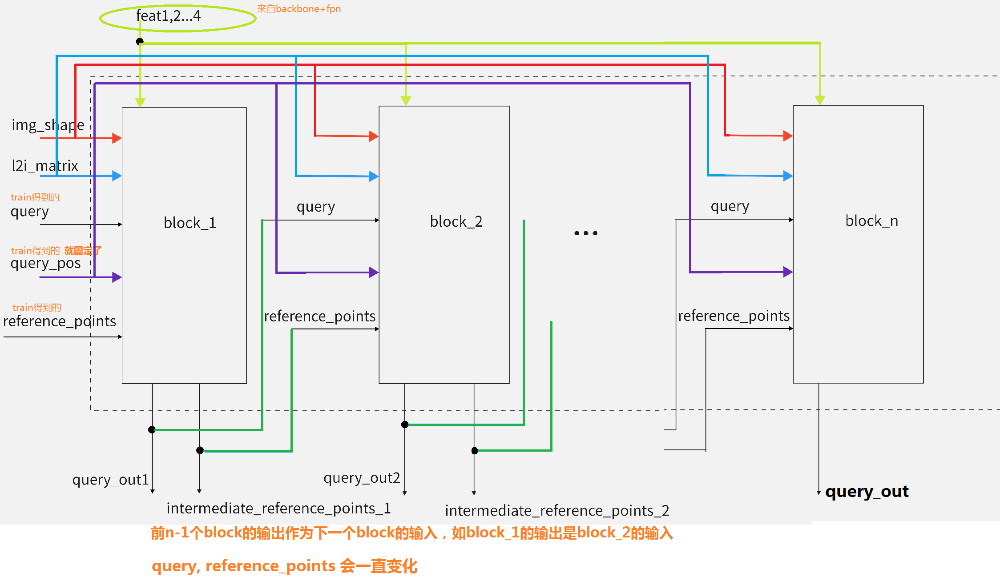
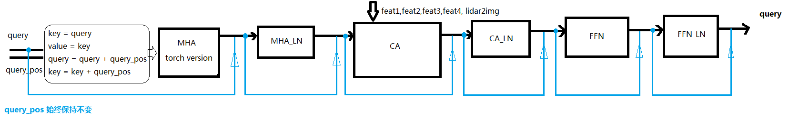

## 完整的decoder 结构图     

      
      

```py
    def forward(self,
                query,
                key,
                value,
                residual=None,
                query_pos=None,
                key_padding_mask=None,
                reference_points=None,
                spatial_shapes=None,
                level_start_index=None,
                **kwargs):
        """Forward Function of SVDetCrossAtten.
        Args:
            query (Tensor): Query of Transformer with shape        `(num_query, bs, embed_dims)`.
            key (Tensor): The key tensor with shape                `(num_key,   bs, embed_dims)`.
            value (Tensor): The value tensor with shape            `(num_value, bs, embed_dims)`. (B, N, C, H, W)
            residual (Tensor): The tensor used for addition, with the same shape as `x`. Default None. If None, `x` will be used.
            query_pos (Tensor): The positional encoding for `query`.    Default: None.
            key_pos (Tensor): The positional encoding for `key`.        Default: None.
            reference_points (Tensor):  The normalized reference
                points with shape (bs, num_query, 4), all elements is range in [0, 1], top-left (0,0),
                bottom-right (1, 1), including padding area.
                or (N, Length_{query}, num_levels, 4), add additional two dimensions is (w, h) to form reference boxes.
            key_padding_mask (Tensor): ByteTensor for `query`, with shape [bs, num_key].
            spatial_shapes (Tensor): Spatial shape of features in different level. With shape  (num_levels, 2), last dimension represent (h, w).
            level_start_index (Tensor): The start index of each level.
                A tensor has shape (num_levels) and can be represented as [0, h_0*w_0, h_0*w_0+h_1*w_1, ...].
        Returns:
             Tensor: forwarded results with shape [num_query, bs, embed_dims].
        """

        if key is None:
            key = query
        if value is None:
            value = key

        if residual is None:
            inp_residual = query

        if query_pos is not None:
            query = query + query_pos

        # change to (bs, num_query, embed_dims)
        query = query.permute(1, 0, 2)

        bs, num_query, _ = query.size()

        attention_weights = self.attention_weights(query).view(bs, 1, num_query, self.num_cams, self.num_points, self.num_levels)

        # reference_points_3d 与 reference_points 关系  ？  其实是一样的    
        reference_points_3d, output, mask = feature_sampling_onnx(value, reference_points, self.pc_range, kwargs['img_shape'], kwargs['lidar2img'])

        attention_weights = attention_weights.sigmoid() * mask

        output = output * attention_weights
        output = output.sum(-1).sum(-1).sum(-1)
        output = output.permute(2, 0, 1)
        
        output = self.output_proj(output)

        # (num_query, bs, embed_dims)
        pos_feat = self.position_encoder(inverse_sigmoid(reference_points_3d)).permute(1, 0, 2)

        return output + inp_residual + pos_feat
```
