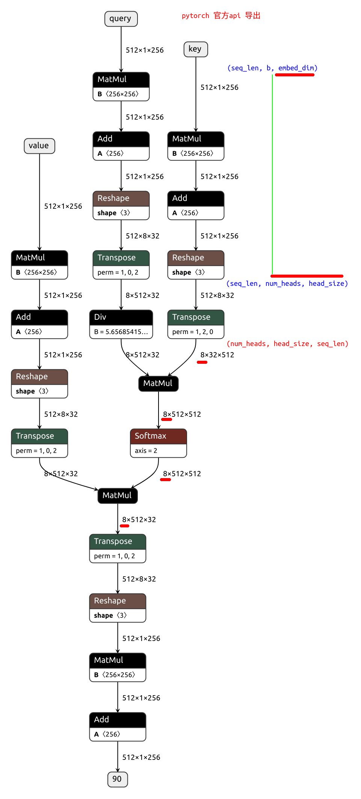
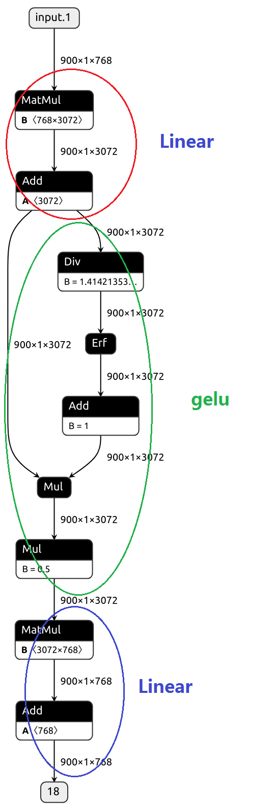

+ mha     
**注意batch在第几维**   
https://github.com/lix19937/dnn-cookbook/blob/main/ViT-pytorch/qkv2ctx_v2.py#L140     
```py
class ViT_Attention(torch.nn.Module):
    def __init__(self, embed_dim, num_heads, batch_first=False):
        super(ViT_Attention, self).__init__()
        self.num_attention_heads = num_heads  # 8
        self.hidden_size = embed_dim          # 256
        self.attention_head_size = int(embed_dim / self.num_attention_heads)     # 256 / 8 =32,  确保能整除 
        self.all_head_size = self.num_attention_heads * self.attention_head_size # 256  

        self.query = Linear(embed_dim, self.all_head_size) ###
        self.key   = Linear(embed_dim, self.all_head_size) ###
        self.value = Linear(embed_dim, self.all_head_size) ###
        self.out   = Linear(embed_dim, embed_dim)          ###

        self.softmax = Softmax(dim=-1)
        self.scaling = 1/ math.sqrt(self.attention_head_size) # float(self.attention_head_size) ** -0.5
        self.batch_first = batch_first

    def transpose_for_scores(self, x): # x shape [512, 1, 256]
        new_x_shape = x.size(0) * + (x.size(1) * self.num_attention_heads, self.attention_head_size)
        x = x.view(*new_x_shape)  # [512, 8, 32]
        return x.permute(1, 0, 2) # [8, 512, 32]

    def forward_vit(self, query, key, value):
        mixed_query_layer = self.query(query)
        mixed_key_layer = self.key(key)
        mixed_value_layer = self.value(value)

        query_layer = self.transpose_for_scores(mixed_query_layer)
        key_layer = self.transpose_for_scores(mixed_key_layer)
        value_layer = self.transpose_for_scores(mixed_value_layer)

        attention_scores = torch.matmul(query_layer, key_layer.transpose(-1, -2))
        attention_scores = attention_scores * self.scaling #1/ math.sqrt(self.attention_head_size)
        attention_probs = self.softmax(attention_scores)

        context_layer = torch.matmul(attention_probs, value_layer)
        context_layer = context_layer.permute(1, 0, 2).contiguous()
        new_context_layer_shape = context_layer.size()[:-2] + (1, self.all_head_size,)
        context_layer = context_layer.view(*new_context_layer_shape)
        attention_output = self.out(context_layer)
        return attention_output

    def forward(self, query, key, value):
      return self.forward_vit(query, key, value)
```
      

+ ffn /mlp
```py

def gelu(x):
    cdf = 0.5 * (1.0 + torch.erf(x / torch.sqrt(2.0)))
    return x*cdf

def relu(x):
    cdf = torch.max(0, x) 
    return cdf
# 克服梯度消失的问题
# 加快训练速度

def forward(self, x):
    x = self.fc1(x)    # cutlass   gemm + bias 
    x = self.act_fn(x) # use gelu  
    x = self.fc2(x)    # cutlass   gemm + bias 
    return x
```   


+ ln
```py
# alpha, beta来自train 阶段得到的    
mean = torch.mean(input, dim=(2), keepdim=True)

# 使用有偏估计 ，即进行总体方差计算     
# var = sum_i(input_i - mean )**2 / n

var = torch.var(input, dim=(2), keepdim=True, unbiased=False)
 
output = alpha * (input - mean) / ((var+1e-5)**0.5) + beta
```


+ ca     

